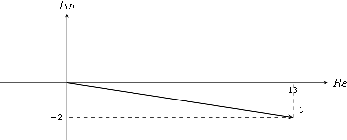
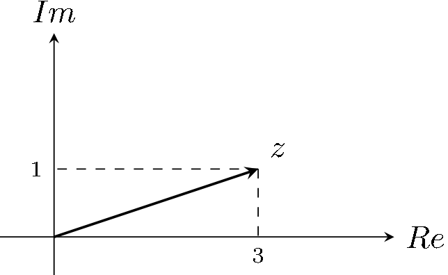
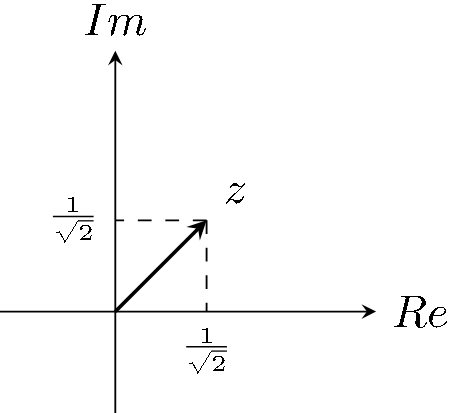
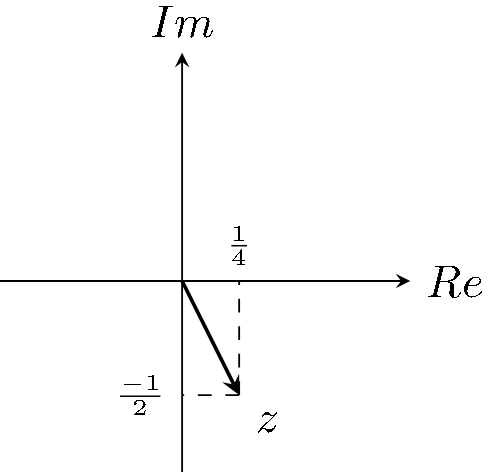

# Ejercicio 2

## Consigna

Expresar los siguientes números complejos en:

- Forma binómica: $a + bi$, con $a,\ b \in \mathbb{R}$  
- Notación polar: $re^{i\theta}$, con $r > 0$ y $\theta \in \mathbb{R}$

1. $(1 + i)^2$
2. $\frac{1}{i}$
3. $\frac{1}{1 + i}$
4. $(2 + 3i)(3 - 4i)$
5. $(1 + i)(1 - 2i)$
6. $i^5 + i^{16}$
7. $-1$
8. $-3i$
9. $1 + i + i^2 + i^3$
10. $\frac{1}{2}(1 + i)(1 - i^{-8})$
11. $\frac{1 + i}{\sqrt{2}}$
12. $\frac{1}{(1 + i)^2}$

## Resolución

### Parte 4

#### Forma binómica y representación en el plano

- $z=(2 + 3i)(3 - 4i)$

Operando:

$$
\begin{aligned}
(2 + 3i)(3 - 4i)&=6-8i+6i+7\\
&=13-2i
\end{aligned}
$$

#### Notación polar

- Módulo: $|z|=\sqrt{13^2+2^2}=\sqrt{173}$
- Ángulo: $arctan(\frac{-2}{13})\simeq -0,15264$

Es muy importante observar si el argumento tiene algún sentido o no. En este caso, si tiene sentido pues el ángulo nos lleva al cuadrante correcto.

### Parte 5

#### Forma binómica y representación en el plano

- $z=(1 + i)(1 - 2i)$

Operando:

$$
\begin{aligned}
(1 + i)(1 - 2i)&=1-2i+i+2\\
&=3+i
\end{aligned}
$$

#### Notación polar

- Módulo: $|z|=\sqrt{3^2+1^2}=\sqrt{10}$
- Ángulo: $arctan(\frac{1}{3})\simeq -0,32175$

Es muy importante observar si el argumento tiene algún sentido o no. En este caso, si tiene sentido pues el ángulo nos lleva al cuadrante correcto.

### Parte 10

- $z=\frac{1}{2}(1 + i)(1 - i^{-8})$

Operando:

$$
\begin{aligned}
\frac{1}{2}(1 + i)(1 - i^{-8})&=\frac{1}{2}(1+i)(1-1)\\
&=0
\end{aligned}
$$

Entonces este complejo es simplemente el 0.

### Parte 11

- $z=\frac{1 + i}{\sqrt{2}}$

#### Forma binómica y representación en el plano

En este caso no tenemos que operar, la forma binómica es:

- $\frac{1}{\sqrt{2}}+i\frac{1}{\sqrt{2}}$

#### Notación polar

- Módulo: $|z|=\sqrt{\frac{1}{\sqrt{2}}^2+\frac{1}{\sqrt{2}}^2}=\sqrt{\frac{1}{2}+\frac{1}{2}}=\sqrt{1}=1$
- Ángulo: $arctan(1)= \frac{\pi}{4}$

**Observación:** El ángulo se determina muy fácilmente usando el gráfico.

### Parte 12

- $z=\frac{1}{(1 + i)^2}$

#### Forma binómica y representación en el plano

Operando:

$$
\begin{aligned}
\frac{1}{(1 + i)^2}&=\frac{1}{1+2i-1}\\
&=\frac{1}{2i}\\
&=\frac{1}{2i}\cdot\frac{-2i}{-2i}\\
&=\frac{1-2i}{4}\\
&=\frac{1}{4}-\frac{1}{2}i
\end{aligned}
$$

#### Notación polar

- Módulo: $|z|=\sqrt{\frac{1}{4}^2+(\frac{-1}{2})^2}=\sqrt{\frac{1}{16}+\frac{1}{4}}=\sqrt{\frac{5}{16}}=\frac{\sqrt{5}}{4}$
- Ángulo: $arctan(\frac{1}{4}\cdot(-2))=arctan(\frac{-1}{2})\simeq -0,46364$

Es muy importante observar si el argumento tiene algún sentido o no. En este caso, si tiene sentido pues el ángulo nos lleva al cuadrante correcto.