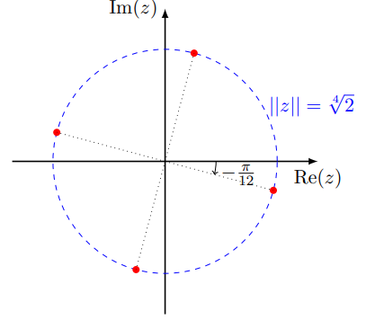

# Ejercicio 2 (evaluaciones anteriores)

## Consigna

Sea $A \subset \mathbb{C}$ el conjunto de los números $z \in \mathbb{C}$ que verifican:

$$
\begin{cases}
z^4 = 1 - i\sqrt{3} \\
z + \bar{z} > 0
\end{cases}
$$

Solo una de las siguientes afirmaciones sobre el conjunto $A$ es correcta. Indique cuál:

(A) $A$ es simétrico respecto al eje real.
(B) $A$ es simétrico respecto al eje imaginario.
(C) $A$ tiene exactamente dos elementos distintos.
(D) $A$ tiene exactamente cuatro elementos distintos.
(E) Todos los elementos de $A$ están en la circunferencia de centro $0$ y radio $1$.

## Resolución

Veamos la información que nos da cada dato:

- $z^4=1-i\sqrt{3}$

Para obtener información de esto, deberíamos pasar a notación polar el complejo con el que queremos igualar, podemos hacer esto con pitágoras (para obtener el módulo):

- $\rho=\sqrt{1^2+\sqrt{3}^2}=\sqrt{4}=2$

Ahora teniendo el módulo, recordemos que la forma polar nos da la siguiente ecuación:

- $1-i\sqrt{3}=2(\cos\theta+i\sin\theta)$

De donde se desprende que:

- $\cos\theta=\frac{1}{2}$
- $\sin\theta=-\frac{\sqrt{3}}{2}$

Por lo que buscamos un ángulo que cumpla con estos requisitos a menos de los signos (por lo general en este tipo de ejercicios tendremos la tabla de valores fundamentales).

El ángulo que cumple esto es $\pi/3$, ya que tenemos que:

- $\cos(\pi/3)=\frac{1}{2}$
- $\sin(\pi/3)=\frac{\sqrt{3}}{2}$

Nosotros tenemos valor del seno como negativo, por lo que estaríamos cambiando de cuadrante (del primero al cuarto), entonces:

- $\theta=-\frac{\pi}{3}$

Entonces lo que tenemos para esta condición es que:

- $z^4=2e^{-i\frac{\pi}{3}}$

Por lo tanto el $z$ genérico que cumple con esto tiene que cumplir que:

- $\rho^4=2$
- $\theta=\frac{-\pi+6k\pi}{12}$

Por lo tanto los argumentos válidos para esto son:

- $k=0\implies\theta=-\frac{\pi}{12}$
- $k=1\implies\theta=\frac{5\pi}{12}$
- $k=2\implies\theta=\frac{11\pi}{12}$
- $k=3\implies\theta=\frac{17\pi}{12}$
- $k=4\implies\theta=\frac{23\pi}{12}=-\frac{\pi}{12}$

Por lo tanto tenemos cuatro argumentos posibles diferentes, para un solo módulo $(\sqrt[4]{2})$.

Ahora tenemos que ir a la siguiente condición, recordando que lo más importante para estos ejercicios es: GRAFICAR.

La condición nos dice que:

- $z+\overline{z}>0$

Es decir que la parte real tiene que ser positiva, por lo tanto tenemos dos complejos que cumplen con estas condiciones.

Se concluye que la respuesta correcta es la C, que nos dice que hay exactamente dos complejos en el conjunto $A$.