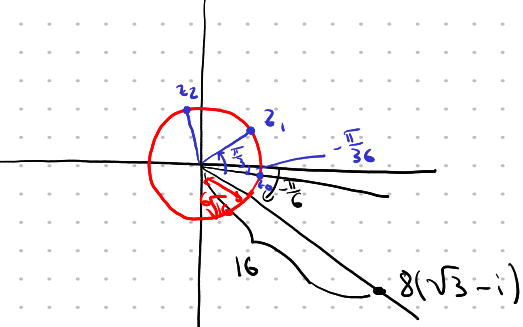

# Ejercicio 5

## Consigna

Representar geométricamente los complejos:

1. $(1 + i)^n - (1 - i)^n$, para algunos valores naturales $n$  
2. Las raíces quintas de 1: los $z$ tales que $z^5 = 1$  
3. Las raíces décimas de 1  
4. Los $z$ tales que $z^6 = 8(\sqrt{3} - i)$

## Resolución

### Parte 1

Consideremos la notación polar de los siguientes complejos:

- $i+1=\sqrt{2}e^{\frac{\pi}{4}i}$
- $i-1=\sqrt{2}e^{-\frac{\pi}{4}i}$

Por lo tanto el complejo que queremos representar es:

$$
\begin{aligned}
&(\sqrt{2}e^{\frac{\pi}{4}i})^n-(\sqrt{2}e^{-\frac{\pi}{4}i})^n\\
&=\scriptstyle{(\text{operatoria})}\\
&\sqrt{2}^ne^{n\frac{\pi}{4}i}-\sqrt{2}^ne^{-n\frac{\pi}{4}i}\\
&=\scriptstyle{(\text{operatoria})}\\
&\sqrt{2}^n(e^{n\frac{\pi}{4}i}-e^{-n\frac{\pi}{4}i})\\
&=\scriptstyle{(\text{notación binómica})}\\
&\sqrt{2}^n\left(\left(cos\left(\frac{n\pi}{4}\right)+isen\left(\frac{n\pi}{4}\right)\right)-\left(cos\left(\frac{-n\pi}{4}\right)+isen\left(\frac{-n\pi}{4}\right)\right)\right)\\
&=\scriptstyle{(\text{usando que }cos(-\theta)=cos(\theta),sen(-\theta)=-sen(\theta))}\\
&\sqrt{2}^n\left(\left(cos\left(\frac{n\pi}{4}\right)+isen\left(\frac{n\pi}{4}\right)\right)-\left(cos\left(\frac{n\pi}{4}\right)-isen\left(\frac{n\pi}{4}\right)\right)\right)\\
&=\scriptstyle{(\text{operatoria})}\\
&\sqrt{2}^n2isen\left(\frac{n\pi}{4}\right)\\
\end{aligned}
$$

**Observación:** Con respecto a la propiedad $cos(-\theta)=cos(\theta),sen(-\theta)=-sen(\theta)$. Quizás parezca que es complicado recordar esto, pero nos simplificó mucho las cuentas (incluso de otra forma quizás no salían) y no es tan díficil de ver. Gráficar las funciones seno y coseno nos permiten ver visualmente dichas igualdades.

Entonces con esta expresión, podemos calcular fácilmente cualquier potencia de la expresión.

- $n=1\to\sqrt{2}\cdot2isen(\frac{\pi}{4})=\sqrt{2}\cdot2i\frac{\sqrt{2}}{2}=2i$
- $n=2\to\sqrt{2}^2\cdot2isen(\frac{2\pi}{4})=4i\cdot1=4i$
- $n=3\to\sqrt{2}^3\cdot2isen(\frac{3\pi}{4})=\sqrt{2}\cdot4i(-\frac{\sqrt{2}}{2})=-4i$
- $n=4\to\sqrt{2}^4\cdot2isen(\pi)=8i(0)=0$

Y así sucesivamente. La representación geométrica de esto es todo sobre la recta de los imaginarios, pues por la fórmula hallada solo tenemos parte imaginaria.

### Parte 4

Queremos representar los $z$ tales que $z^6 = 8(\sqrt{3} - i)$.

Para esto hallemos la notación polar de $8(\sqrt{3}-i)$:

- $8(\sqrt{3}-i)=8\sqrt{3}-8i$

Por lo tanto tenemos que:

- Módulo: $\sqrt{8\sqrt{3}^2+8^2}=\sqrt{256}=16$
- Argumento: $arctan(\frac{-8}{8\sqrt{3}})=arctan(\frac{-1}{\sqrt{3}})=arctan(\frac{-\sqrt{3}}{3})=\frac{-\pi}{6}$

Por lo tanto queremos hallar un $z=re^{i\theta}$ que cumpla lo siguiente:

- $r^6e^{i6\theta}=16e^{i\frac{\pi}{6}}$

Esto deriva en las siguientes ecuaciones:

- $r^6=16\to r=\sqrt[6]{16}$
- $6\theta=\frac{-\pi}{6}+2k\pi\to\theta=\frac{-\pi}{36}+\frac{k\pi}{3}\quad\text{con }k\in\mathbb{Z}$

De donde obtenemos las raíces sextas de $8(\sqrt{3} - i)$:

- $z_0=\sqrt[6]{16}e^{i\frac{-\pi}{36}}$
- $z_1=\sqrt[6]{16}e^{i(\frac{-\pi}{36}+\frac{\pi}{3})}$
- $z_2=\sqrt[6]{16}e^{i(\frac{-\pi}{36}+\frac{2\pi}{3})}$
- $z_3=\sqrt[6]{16}e^{i(\frac{-\pi}{36}+\pi)}$
- $z_4=\sqrt[6]{16}e^{i(\frac{-\pi}{36}+\frac{4\pi}{3})}$
- $z_5=\sqrt[6]{16}e^{i(\frac{-\pi}{36}+\frac{5\pi}{3})}$

La imagen de lo que hallamos sería algo así (no encontré una imagen mejor):

