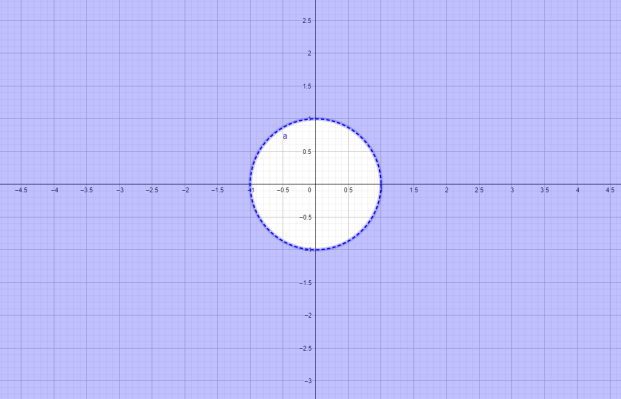
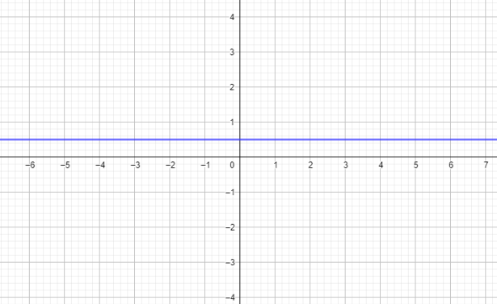
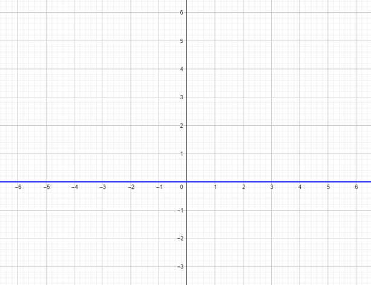
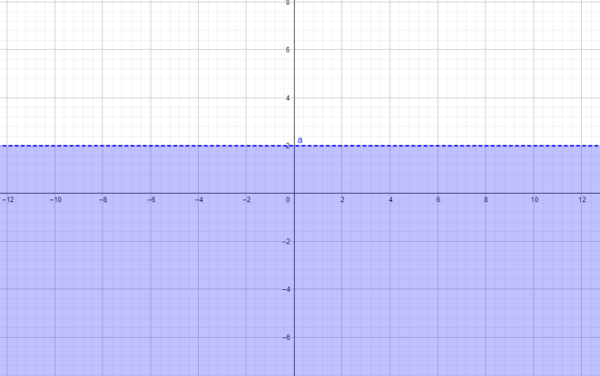
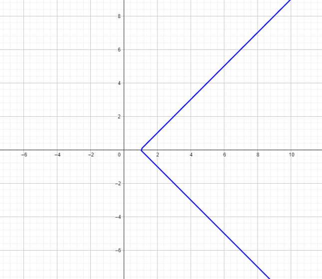

# Ejercicio 6

## Consigna

Encontrar el conjunto de $z \in \mathbb{C}$ que satisfacen las condiciones, y representarlos geométricamente:

1. $|z| > 1$
2. $z - \overline{z} = i$
3. $|z - i| = |z + i|$
4. $Im(z) < 2$
5. $|z - \overline{z}| = 2 Re(z - 1)$

## Resolución

### Parte 1

- $|z| > 1$

Esta parte se entiende muy fácilmente con su representación gráfica:

### Parte 2

- $z - \overline{z} = i$

En este caso operemos un poco para simplificar la expresión, sea $z=a+bi$:

$$
\begin{aligned}
&z - \overline{z} = i\\
&\iff\\
&a+bi-(a-bi)=i\\
&\iff\\
&2bi=i\\
&\iff\\
&2b=1\\
&\iff\\
&b=\frac{1}{2}\\
\end{aligned}
$$

Por lo tanto la representación gráfica es la siguiente:

### Parte 3

- $|z - i| = |z + i|$

En este caso operemos un poco para simplificar la expresión, sea $z=a+bi$:

$$
\begin{aligned}
&|z - i| = |z + i|\\
&\iff\\
&|a+bi - i| = |a+bi + i|\\
&\iff\\
&|a+(b-1)i| = |a+(b+1)i|\\
&\iff\\
&\sqrt{a^2+(b-1)^2} = \sqrt{a^2+(b+1)^2}\\
&\iff\\
&a^2+b^2-2b+1 = a^2+b^2+2b+1\\
&\iff\\
&-2b=2b\\
&\iff\\
&4b=0\\
&\iff\\
&b=0\\
\end{aligned}
$$

Por lo tanto la representación gráfica es la siguiente:

### Parte 4

- $Im(z) < 2$

Esta parte se entiende muy fácilmente con su representación gráfica

### Parte 5

- $|z - \overline{z}| = 2 Re(z - 1)$

En este caso operemos un poco para simplificar la expresión, sea $z=a+bi$:

$$
\begin{aligned}
&|z - \overline{z}| = 2 Re(z - 1)\\
&\iff\\
&|i2b|= 2(a-1)\\
&\iff\\
&|i2b|= 2(a-1)\\
&\iff\\
&2b= 2a-2\\
&\iff\\
&b= a-1\\
\end{aligned}
$$

Por lo tanto la representación gráfica es la siguiente:

