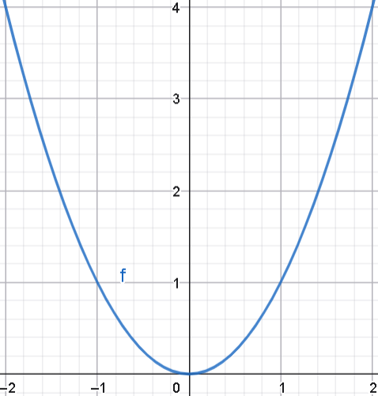
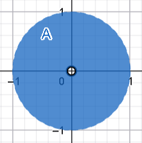

# Ejercicio 2

## Consigna

Se definen los siguientes conjuntos:

- $A_1 = \{(x, y) \in \mathbb{R}^2 : 1 \le x \le 2,\ 1 < y < 3\}$
- $B = A_1 \cap \mathbb{Q}^2$
- $A_2 = \{(x, y) \in \mathbb{R}^2 : y = x^2\}$
- $A_3 = \{(x, y) \in \mathbb{R}^2 : x^2 + y^2 < 1,\ (x, y) \ne (0, 0)\}$
- $C = A_3 \cap \mathbb{Q}^2$
- $A_4 = \{(x, y) \in \mathbb{R}^2 : 2x^2 + y^2 < 1\} \cup \{(x, y) \in \mathbb{R}^2 : x = y\}$
- $A_5 = \{(x, y) \in \mathbb{R}^2 : x = (-1)^n + \tfrac{1}{n},\ y = 1,\ n \ge 1\}$
- $A_6 = \{(x, y, z) \in \mathbb{R}^3 : x + y + z < 1,\ x > 0,\ y > 0,\ z > 0\}$
- $A_7 = \{(x, y, z) \in \mathbb{R}^3 : x^2 + y^2 + 1 \le z\}$

1. Representarlos gráficamente e investigar si están acotados.  
2. Hallar el interior, la frontera y la clausura de cada uno de ellos.  
3. Hallar el conjunto de sus puntos de acumulación.  
4. Indicar si son abiertos.  
5. Indicar si son cerrados.  
6. Indicar si son compactos.

## Resolución

### Conjunto $A_1$

- $A_1 = \{(x, y) \in \mathbb{R}^2 : 1 \leq x \leq 2,\ 1 < y < 3\}$

1. Efectivamente el conjunto está acotado considerando $K=4$ por la bola $B(0,4)$
2. Veamos los conjuntos:
    - $\mathring{A}_1=\{(x, y) \in \mathbb{R}^2 : 1 < x < 2,\ 1 < y < 3\}$
    - $\partial A_1=\{(x, y) \in \mathbb{R}^2 : 1 \leq x \leq 2, y\in\{1,3\}\}\cup\{(x, y) \in \mathbb{R}^2 : x\in\{1,2\}, 1\leq y\leq 3\}$
    - $\overline{A}_1=\{(x, y) \in \mathbb{R}^2 : 1 \leq x \leq 2,\ 1 \leq y \leq 3\}$
3. El conjunto de puntos de acumulación es $A_1'=\{(x, y) \in \mathbb{R}^2 : 1 \leq x \leq 2,\ 1 \leq y \leq 3\}$
4. $A_1$ no es abierto, pues contiene puntos frontera.
5. $A_1$ no es cerrado, pues $A_1^C$ contiene puntos frontera.
6. $A_1$ no es cerrado, por lo que no es compacto.

### Conjunto $B$

- $B = A_1 \cap \mathbb{Q}^2$

Este conjunto no es graficable, pero la intuición está en el gráfico de $A_1$.

1. Efectivamente el conjunto está acotado considerando $K=4$ por la bola $B(0,4)$
2. Veamos los conjuntos:
    - $\mathring{B}=\emptyset$ pues para cualquier $B(p,\delta)$ existe por lo menos algún punto de coordenadas irracionales que queda por fuera del conjunto.
    - $\partial B=\{(x, y) \in \mathbb{R}^2 : 1 \le x \le 2,\ 1 \leq y \leq 3\}=\overline{A}_1$
    - $\overline{B}=\partial B$
3. El conjunto de puntos de acumulación es:
    - $B'=\partial B$
4. $B$ no es abierto, pues no tiene ningún punto interior.
5. $B$ no es cerrado, pues su complemento $B^C$ contiene puntos frontera (no es abierto).
6. $B$ no es cerrado, por lo que no es compacto.

### Conjunto $A_2$

- $A_2 = \{(x, y) \in \mathbb{R}^2 : y = x^2\}$

1. Claramente el conjunto $A_2$ es NO acotado.
2. Veamos los conjuntos:
    - $\mathring{A}_2=\emptyset$
    - $\partial A_2=A_2$
    - $\overline{A}_2=A_2$
3. El conjunto de puntos de acumulación es:
    - $A_2'=A_2$
4. El conjunto $A_2$ no es abierto pues no tiene puntos internos.
5. El conjunto $A_2$ es cerrado, pues su complemento $A_2^C$ no contiene puntos frontera.
6. El conjunto $A_2$ no es compacto pues no está acotado.

### Conjunto $A_3$

- $A_3 = \{(x, y) \in \mathbb{R}^2 : x^2 + y^2 < 1,\ (x, y) \ne (0, 0)\}$

1. El conjunto $A_3$ está acotado considerando $K=2$ por la bola $B(0,2)$
2. Veamos los conjuntos:
    - $\mathring{A_3}=A_3$
    - $\partial A_3=\{(x,y)\in\mathbb{R}^2: x^2+y^2=1\}\cup\{(0,0)\}$
    - $\overline{A_3}=\{(x,y)\in\mathbb{R}^2: x^2+y^2\leq 1\}$
3. El conjunto de puntos de acumulación es:
    - $A_3'=\overline{A_3}$
4. El conjunto $A_3$ es abierto pues contiene a todos sus puntos interiores
5. El conjunto $A_3$ no es cerrado pues su complemento $A_3^C$ contiene puntos frontera (no es abierto)
6. El conjunto $A_3$ no es cerrado, por lo tanto no es compacto

### Conjunto $C$

- $C = A_3 \cap \mathbb{Q}^2$

El conjunto no es gráficable, pero la intuición de como funciona está en la gráfica de $A_3$

1. El conjunto $C$ está acotado considerando $K=2$ por la bola $B(0,2)$
2. Veamos los conjuntos:
    - $\mathring{C}=\emptyset$
    - $\partial C=A_3\cup\partial A_3=\overline{A_3}$
    - $\overline{C}=\overline{A_3}$
3. El conjunto de puntos de acumulación es:
    - $C'=\overline{C}$
4. El conjunto $C$ no es abierto pues no tiene puntos interiores
5. El conjunto $C$ no es cerrado pues su complemento $C^C$ contiene puntos frontera (no es abierto)
6. El conjunto $C$ no es cerrado, por lo tanto no es compacto

### Conjunto $A_4$

- $A_4 = \{(x, y) \in \mathbb{R}^2 : 2x^2 + y^2 < 1\} \cup \{(x, y) \in \mathbb{R}^2 : x = y\}$

1. El conjunto claramente es no acotado.
2. Veamos los conjuntos:
    - $\mathring{A_4}=\{(x, y) \in \mathbb{R}^2 : 2x^2 + y^2 < 1\}$
    - $\partial A_4=\{(x, y) \in \mathbb{R}^2 : 2x^2 + y^2 = 1\}\cup\left(\{(x, y) \in \mathbb{R}^2 : x = y\}\setminus\{(x, y) \in \mathbb{R}^2 : 2x^2 + y^2 < 1\}\right)$
    - $\overline{A_4}=\{(x, y) \in \mathbb{R}^2 : 2x^2 + y^2 \leq 1\} \cup \{(x, y) \in \mathbb{R}^2 : x = y\}$
3. El conjunto de puntos de acumulación es:
    - $A_4'=\overline{A_4}$
4. El conjunto $A_4$ no es abierto pues contiene puntos frontera.
5. El conjunto $A_4$ no es cerrado pues su complemento $A_4^C$ contiene puntos frontera (no es cerrado)
6. El conjunto $A_4$ no es cerrado, por lo tanto tampoco es compacto.
