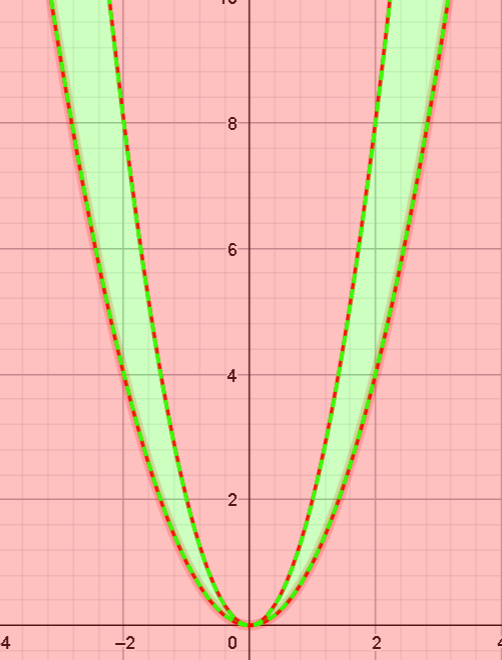
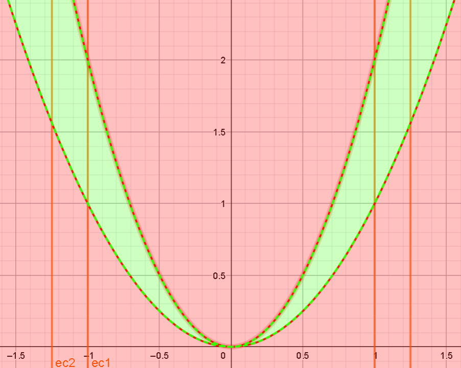
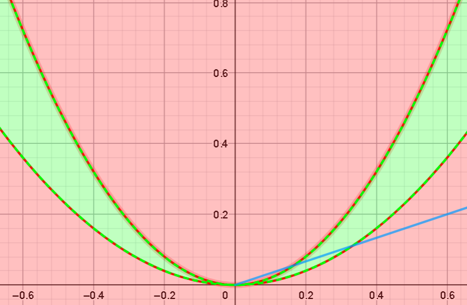

# Ejercicio 6

## Consigna

Representar gráficamente la siguiente función $f:\mathbb{R}^2\to\mathbb{R}$, bosquejando las curvas de nivel:

$$
f(x,y) =
\begin{cases}
0 &y\le x^2\text{ o }2x^2\le y\\
|x| &x^2<y<2x^2
\end{cases}
$$

Demostrar que $f$ es continua, que existen todas las derivadas direccionales en $(0,0)$ y que, sin embargo, $f$ no es diferenciable en ese punto.

## Resolución

El gráfico del dominio de la función es el siguiente, donde:

- La parte roja es donde la función vale $0$.
- La parte verde es donde la función vale $|x|$.

### Curvas de nivel

$C_a$ es el conjunto de puntos $(x,y)\in\mathbb{R}^2$ tales que:

- $a=\pm x$
- $a^2<y<2a^2$

Gráficamente, se ven de la siguiente forma, solo en las regiones verdes.

### Continuidad

Para verificar la continuidad, queremos ver que para $a=(0,0)$ se cumple que:

- $\forall\varepsilon>0,\exists\delta>0$ tal que $\forall (x,y)\in B((0,0),\delta)\cap D: f(x)\in B((0,0),\varepsilon)$
- O alternativamente, $\forall\varepsilon>0,\exists\delta>0$ tal que si $\|(x,y)-(0,0)\|<\delta$, entonces $|f(x,y)-0|<\varepsilon$

Con esta última definición, queda bastante claro la continuidad al sustituir, aunque notemos que hay dos casos (con uno trivial):

- Si tenemos que $y\leq x^2\text{ o }2x^2\leq y$, entonces tenemos que para cualquier punto $(x,y)$ se cumple $|0-0|<\varepsilon$, por lo que para estos puntos la función es continua.
- Por otra parte, si tenemos que $x^2<y<2x^2$ hay que tener un poquito más de cuidado, pero es fácil notar que al tomar $\delta_{\varepsilon}:=\varepsilon$, se cumple que:

    - Si $\|(x,y)\|<\varepsilon$, entonces $|x|<\varepsilon$

    Por lo tanto para estos puntos la función también es continua.

Concluyendo, la función es continua en $(0,0)$

### Derivadas direccionales

Consideremos $v=(v_1,v_2)$ un vector de dirección genérico, y separamos dos casos.

#### Direcciones tales que $hv_2\leq (hv_1)^2\text{ o }2(hv_1)^2\leq hv_2$

$$
\begin{aligned}
&\frac{\partial f}{\partial v}(0,0)\\
&=\scriptstyle{(\text{definición de derivada direccional})}\\
&\lim_{h\to0}\frac{f(hv_1,hv_2)-f(0,0)}{h}\\
&=\scriptstyle{(\text{definición de la función para este caso})}\\
&\lim_{h\to0}\frac{0-0}{h}\\
&=\scriptstyle{(\text{operatoria})}\\
&0
\end{aligned}
$$

#### Direcciones tales que $(hv_1)^2<hv_2<2(hv_1)^2$

Para esta parte el mejor argumento es geométrico, lo que sucede es que al acercarnos por cualquier recta al origen (eso es lo que hacemos al tomar un vector dirección), eventualmente vamos a estar por fuera del área donde la función vale $|x|$, esto sucede porque esta región está restringida por una función cuadrática, es decir una parábola.

Este argumento es suficiente, ya que como la función es constante nula para $h$ arbitrariamente cerca de cero, su derivada también es cero (basta con reemplazar en la definición).
Si se quisiera, uno puede ser más fino y expresar lo mismo con símbolos matemáticos $(\varepsilon, \delta)$, pero creo que se entiende bien.

### Diferenciabilidad

Para verificar que la función NO es diferenciable, razonaremos por absurdo. Asumimos entonces que la función es diferenciable en $(0,0)$, entonces se tiene que cumplir lo siguiente:

- El diferencial de la función (la aproximación lineal de la función para el punto $(0,0)$) es: $d(0,0)f(v_1,v_2)=\frac{\partial f}{\partial x}(0,0)v_1,\frac{\partial f}{\partial y}(0,0)v_2=0$.

Con esto, también se tiene que cumplir que el siguiente límite existe y es cero:

$$
\begin{aligned}
&\lim_{(v_1,v_2)\to0}\frac{f(v_1,v_2)-f(0,0)-d(0,0)f(v_1,v_2)}{\|(v_1,v_2)\|}\\
&=\scriptstyle{(\text{reemplazando lo conocido})}\\
&\lim_{(v_1,v_2)\to0}\frac{f(v_1,v_2)}{\|(v_1,v_2)\|}\\
&=^?\\
&0
\end{aligned}
$$

Veamos que pasa si tomamos la dirección $y=\frac{3}{2}x^2$ (recordemos siempre mirar el dominio de la función para tomar estas direcciones).

$$
\begin{aligned}
&\lim_{(v_1,v_2)\to0}\frac{f(v_1,v_2)}{\|(v_1,v_2)\|}\\
&=\scriptstyle{(\text{reemplazando por la dirección que elegimos})}\\
&\lim_{x\to0}\frac{f(x,\frac{3}{2}x^2)}{\|(x,\frac{3}{2}x^2)\|}\\
&=\scriptstyle{(\text{definición de la función y norma})}\\
&\lim_{x\to0}\frac{|x|}{\sqrt{x^2+\frac{9}{4}x^4}}\\
&=\scriptstyle{(\text{operatoria})}\\
&\lim_{x\to0}\frac{|x|}{\sqrt{x^2(1+\frac{9}{4}x^2)}}\\
&=\scriptstyle{(\text{operatoria})}\\
&\lim_{x\to0}\frac{\cancel{|x|}}{\cancel{|x|}\sqrt{1+\frac{9}{4}x^2}}\\
&=\scriptstyle{(\text{operatoria})}\\
&\lim_{x\to0}\frac{1}{\sqrt{1+\frac{9}{4}x^2}}\\
&=\scriptstyle{(\text{operatoria})}\\
&1
\end{aligned}
$$

Pero esto es absurdo pues el límite tiene que ser 1. Concluimos que la función no es diferenciable.

Notemos que usamos algunas definiciones "nuevas" para la diferenciablidad, por más que parezca algo nuevo, solo son adaptaciones de la definición original.