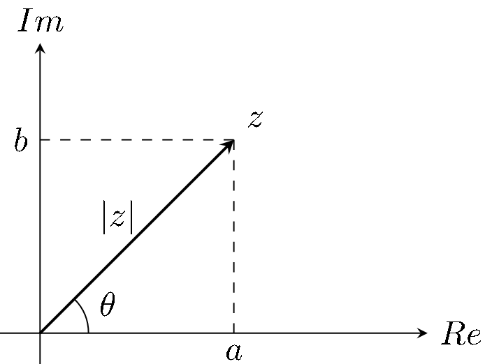
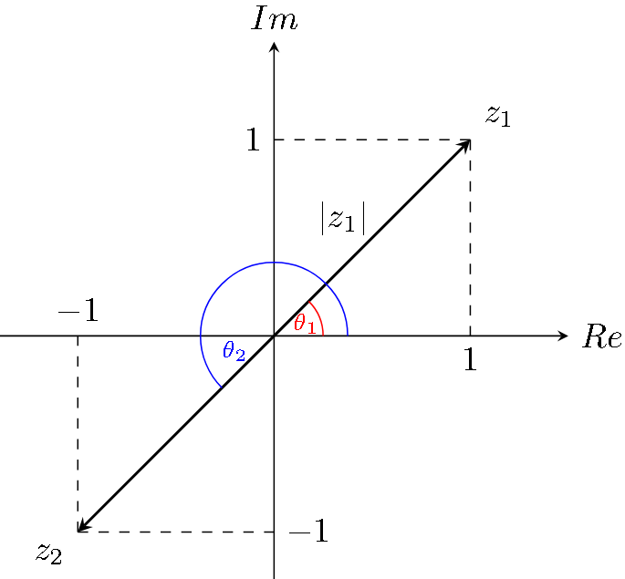

# CLASE 1 - 24/07/2025

## Números complejos

### Definición y operatoria

Definimos un número complejo como un par ordenado de números reales $z=(a,b)$. Llamamos parte real a $a=Re(z)$ y parte imaginaria a $b=Im(z)$.

Además de esto también definimos las operaciones básicas del cuerpo. Sean $z=(a,b)$ y $w=(c,d)$, entonces:

1. Igualdad $(a,b)=(c,d)$ sii $a=c$ y $b=d$
2. Suma: $(a,b)+(c,d)=(a+c,b+d)$
3. Producto: $(a,b)\cdot(c,d)=(ac-bd,ad+bc)$

Observemos que realizando un pequeño sistema de ecuaciones podemos llegar a que el inverso de un complejo $(a,b)$ cualquiera es el siguiente:

- $(a,b)^{-1}=(\frac{a}{a^2+b^2},\frac{-b}{a^2+b^2})$

### Notación binómica

Dado un complejo cualquiera $z=(a,b)$, definimos su notación binómica por:

- $z= a+bi$

Esta es la primera notación con la que vamos a trabajar con los complejos, que es más práctica que la anterior ya que se comporta bien con todas las operaciones que definimos (porque el producto se puede obtener usando distributiva).

### Definición (norma y argumento)

Dado un complejo $z=a+bi$, definimos su módulo como $|z|=\sqrt{a^2+b^2}$ y su argumento $\theta$ como el ángulo que forma con el eje real.

Veamos como se ve todo al representarlo gráficamente:

#### Observación importante

Al estar trabajando con ángulos, está claro que dos argumentos $\theta_1,\theta_2$ son iguales en ambos los siguientes casos:

- $\theta_1=\theta_2$ o
- $\theta_1=\theta_2+2k\pi$ con $k\in\mathbb{Z}$

La intuición es sencilla, un ángulo se mantiene igual si damos una vuelta completa.

#### Detalle sobre el argumento

Se observa, mirando la representación gráfica, que podemos cálcular el argumento $\theta$ de un complejo, a partir de ambas su parte real e imaginaria de la siguiente forma:

- $tan(\theta)=\frac{b}{a}$, entonces
- $\theta=arctan(\frac{b}{a})$

Pero debemos tener cuidado en como aplicamos $arctan$, por la naturaleza que tiene la función (pues varios ángulos diferentes entre si tienen el mismo valor de $arctan$)

#### Ejemplo

Consideremos el complejo $z_1=1+i$, el mismo tiene:

- Norma: $|z|=\sqrt{2}$
- Argumento: $arctan(\frac{1}{1})=\frac{\pi}{4}$

Ahora, consideremos el complejo $z_2=-1-i$, el mismo tiene:

- Norma: $|z|=\sqrt{2}$
- Argumento: $arctan(\frac{-1}{-1})=\frac{\pi}{4}$

Entonces, algo tiene que estar mal, pues sabemos que $z_1\neq z_2$ pero tienen mismo argumento y norma. El problema viene de que la tangente tiene varias ramas, y estamos usando en ambos casos la que se define en el intervalo $(\frac{-\pi}{2},\frac{\pi}{2})$, por lo que en algunos casos, debemos corregir sumando (o restando) $\pi$.
En general lo que debemos hacer es corroborar que el resultado tenga sentido con la representación gráfica.

