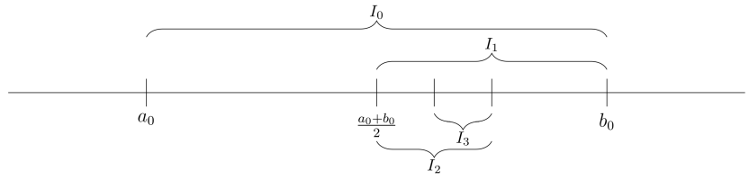

# Clase 10

## Sucesiones

### Definición (subsucesión) 3.19

Sea $a_n$ una sucesión real, y $n_k$ una sucesión estrictamente creciente de números naturales. Entonces la sucesión $a_{n_k}$ es una subsucesión de $a_n$.

La sucesión $n_k$ es la que juega el papel de elegir los índices con los que nos vamos a quedar, y al ser una sucesión creciente de números naturales, tenemos asegurado que $n_k$ tiende a infinito (y por lo tanto vamos a elegir infinitos términos de $a_n$)

#### Ejemplos

1. Sea la sucesión $a_n=(-1)^n$. Podemos considerar las siguientes subsucesiones:
    - $a_{2n}=1$
    - $a_{2n+1}=-1$

    Donde estas últimas, convergen. Lo cual es extraño visto que la sucesión original no es convergente.
2. Sea la sucesión $a_n=n + (-1)^nn$. Podemos considerar las siguientes subsucesiones:
    - $a_{2n+1}=0$
    - $a_{2n}=2n$

Veamos que en ambos ejemplos, encontramos subsucesiones convergentes de sucesiones divergentes. Esto no siempre es el caso, existen algunas sucesiones que no tienen subsucesiones convergentes.
Veamos un resultado que nos dice que si una sucesión es convergente, entonces todas sus subsucesiones también convergen y heredan el mismo límite.

### Teorema 3.21

Si $\lim a_n=L$, entonces toda subsucesión de $a_n$ converge a $L$.

#### Demostración

Sea $a_{n_k}$ una subsucesión y sea $\varepsilon > 0$.
Como $a_n\to L$, existe un $n_0\in\mathbb{N}$ tal que $\forall n>n_0: a_n\in E(L,\varepsilon)$.
Pero como $n_k$ tiende a infinito, existe un $k_0$ tal que $n_k>n_0\quad\forall k>k_0$.
Por lo tanto se tiene que:

- $\forall k>k_0(>n_0): a_{n_k}\in E(L,\varepsilon)$

### Definición 3.22

Decimos que un punto $a\in\mathbb{R}$ es un punto de acumulación de un conjunto $A\subset\mathbb{R}$ sii todo entorno reducido de $a$ contiene algún punto de $A$. Es decir si
- $\forall\varepsilon>0$ se tiene $E^*(a,\varepsilon)\cap A\neq\emptyset$.

Observar que no se dice nada sobre la pertenencia de $a$ al conjunto $A$. Esto significa que pueden haber puntos de acumulación que no sean elementos de $A$.

#### Ejemplos 3.23

1. Para el conjunto $A=[0,1)$, todos los puntos de $[0,1]$ son puntos de acumulación de $A$.
2. Si $A=\{\frac{1}{n}:n\in\mathbb{N}\}$, entonces el único punto de acumulación es 0, que además no está en $A$.

### Teorema 3.24 (Bolzano-Weierstrass)

Todo conjunto infinito y acotado tiene al menos un punto de acumulación.

#### Demostración

Llamemos $A$ al conjunto. Como éste está acotado, lo podemos incluir en un intervalo al que llamaremos:

- $I_0=[a_0,b_0]$

Ahora, si dividimos a este intervalo en dos partes iguales:

- $[a_0, \frac{a_0+b_0}{2}]$, y
- $[\frac{a_0+b_0}{2}, b_0]$

Tenemos que como el conjunto $A$ es infinito, entonces al menos una de las dos mitades debe contener infinitos puntos de $A$. A este intervalo lo llamaremos:

- $I_1=[a_1,b_1]$

A partir de aquí podemos repetir el proceso para obtener una sucesión de intervalos encajados $I_{n+1}\subset I_n$, todos ellos con infinitos elementos de $A$. La longitud de estos intervalos $I_n$ es:

- $\frac{b_0-a_0}{2^n}$

Por un corolario el ejercicio 3.13 sobre PMSC, tenemos que la intersección de estos intervalos define un punto $L=\bigcap_{n\in\mathbb{N}} I_n$.

Lo que queremos ver ahora es que este punto $L$ es efectivamente un punto de acumulación de $A$.
Para esto, consideremos $\varepsilon>0$, y tomamos un $N\in\mathbb{N}$ tal que $\frac{b_0-a_0}{2^N}<\varepsilon$ (esto existe pues $\frac{b_0-a_0}{2^n}$ tiende a 0 cuando $n$ es muy grande).
Tenemos que $L\in I_N$ y el tamaño de este intervalo es menor que el radio del entorno, se tiene que:

- $I_N\subset E(L,\varepsilon)$

Luego, como en $I_N$ hay infinitos puntos de $A$, tenemos que en particular existe $a\in A$ tal que $a\in I_N$ por lo tanto:

- $a\in E(L,\varepsilon)$

Esto concluye la prueba.