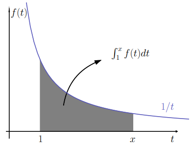
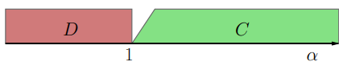
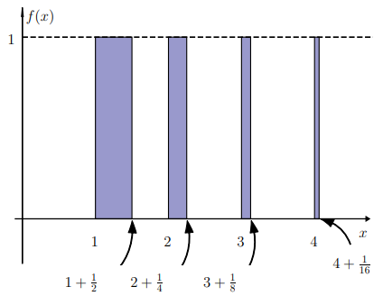

# CLASE 15 - 24/09/2025

## Integrales impropias

Cuando inicialmente fue definida la integral, teníamos que tener en cuenta dos aspectos:

- Que el intervalo de integración fuera acotado, y
- Que la función a integrar fuera acotada en dicho intervalo.

En lo que sigue, vamos a levantar estas dos consideraciones, dando lugar a las integrales impropias de primera y segunda especie respectivamente.

## Integrales impropias de primera especie

### Definición 4.1

Sea $f:[a,\infty)\to\mathbb{R}$ continua, y llamemos $F(x)=\int_a^xf(t)dt$. Consideremos $\lim_{x\to\infty}F(x)$:

- Si es finito, entonces decimos que la integral impropia $\int_a^{\infty}f(x)dx$ converge a ese valor.
- Si es infinito, entonces decimos que la integral impropia $\int_a^{\infty}f(x)dx$ diverge.
- Por último, si el límite no existe, decimos que la integral impropia $\int_a^{\infty}f(x)dx$ oscila.

### Ejemplos 4.2

#### Ejemplo 1

El primer caso que estudiaremos es el de la impropia:

- $\int_{1}^{\infty}\frac{1}{x^{\alpha}}dx$

Para esto, queremos calcular la primitiva:

$$
F(x)=\int_{1}^{x}\frac{1}{t^{\alpha}}dt=\int_{1}^{x}t^{-\alpha}dt
$$

Entonces tenemos dos casos para distinguir:

$$
\begin{aligned}
&\begin{cases}
\log(t)\quad\text{si }t=1\\
\frac{t^{-\alpha+1}}{-\alpha+1}\big|_1^x\quad\text{si }t\neq1\\
\end{cases}\\
&=\\
&\begin{cases}
\log(t)\quad\text{si }t=1\\
\frac{x^{-\alpha+1}-1}{-\alpha+1}\quad\text{si }t\neq1\\
\end{cases}\\
\end{aligned}
$$

Entonces tenemos que:

- Si $\alpha>1$, entonces $\lim_{x\to\infty}F(x)=\frac{1}{\alpha-1}$
    - Por lo que la integral impropia $\int_{1}^{\infty}\frac{1}{x^{\alpha}}$ converge a $\frac{1}{\alpha-1}$ en este caso.

- Si $\alpha\leq1$, entonces la integral impropia $\int_{1}^{\infty}\frac{1}{x^{\alpha}}$ diverge.

#### Ejemplo 2

Estudiemos la impropia:

- $\int_{0}^{+\infty}\frac{1}{1+x^2}dx$

Para esto, queremos calcular la primitiva:

$$
F(x)=\int_{0}^{x}\frac{1}{1+t^2}dt=\arctan(x)-\arctan(0)=\arctan(x)
$$

Entonces tenemos que:

- $\lim_{n\to+\infty}arctan(x)=\frac{\pi}{2}$

**Observación:** Para el cálculo de este límite, lo mejor es graficar la función y observar su comportamiento a partir de la función inversa $(\tan(x))$

### Proposición 4.3

Si $\int_{a}^{\infty}f(t)dt$ y $\int_{a}^{\infty}g(t)dt$ convergen, entonces:

- $\int_{a}^{\infty}(\alpha f(t)+\beta g(t))dt$ también converge y vale:
- $\alpha\int_{a}^{\infty}f(t)dt+\beta\int_{a}^{\infty}g(t)dt$

En el caso de las series, teníamos que si una serie converge, entonces necesariamente su término general $a_n$ converge a 0.
Será que para las integrales impropias tenemos un resultado similar? Es decir, seremos capaces de construir una función $f(t)$ que no tienda a cero, cuya integral impropia sea convergente?
El siguiente ejemplo muestra que con las funciones tenemos un poco más de libertad que con las sucesiones.

### Ejemplo 4.4

Tomemos la función $f:[0,+\infty)\to\mathbb{R}$ definida por:

$$
f(x)=
\begin{cases}
1\quad\text{si }x\in[n,n+\frac{1}{2^n}],\text{ con }n\in\mathbb{N}\\
0\quad\text{en otro caso}
\end{cases}
$$

Es decir, son escalones de altura constante, que empiezan en cada natural y tienen un ancho cada vez menor (ver figura). Entonces si $F(x)=\int_{0}^{+\infty}f(t)dt$, es claro que $F(n)$ es la suma de las áreas de los primeros $n$ escalones: $F(n)=\sum_{k=0}^{n-1}\frac{1}{2^k}$, que forma una serie geométrica que converge a 2.

Entonces la integral impropia $\int_{0}^{+\infty}f(t)dt$ es convergente, aunque la función $f(t)$ no tienda a 0 cuando $x$ tiende a infinito.

En este caso particular, la función no tiene límite cuando $x\to\infty$. Sin embargo, si agregamos como hipótesis que el límite exista, entonces si tenemos una condición similar a la que teníamos con series.

### Proposición 4.5

Sea $f$ tal que $\int_{a}^{\infty}f(t)dt$ converge, y existe $\lim_{x\to\infty}f(x)=L$. Entonces $L=0$.

**Observación:** No se demuestra en las notas, pero la idea es que si la función tiende a un $L\neq0$, entonces me puedo construir un rectángulo con area divergente, que es más pequeño que el área de la función, por lo que $L$ tiene que ser 0.

### Proposición 4.6 (criterio de comparación)

Sean $f$ y $g$ funciones continuas tales que $0\leq f(t)\leq g(t)$ para todo $t>a$. Entonces:

- Si $\int_{a}^{\infty}g(t)dt$ converge, entonces $\int_{a}^{\infty}f(t)dt$ también converge.
- Si $\int_{a}^{\infty}f(t)dt$ diverge, entonces $\int_{a}^{\infty}g(t)dt$ también diverge.

La demostración es análoga a la hecha en el capítulo de series.

### Ejemplos 4.7

#### Ejemplo 1

A pesar de que ya cálculamos el valor de $\int_{0}^{\infty}\frac{1}{x^2+1}dx$, podemos clasificarla observando que:

- $\frac{1}{x^2+1}\leq\frac{1}{x^2}$

Y como tenemos que $\int_{1}^{\infty}\frac{1}{x^2}dx$ converge, también lo hace $\int_{0}^{\infty}\frac{1}{x^2+1}dx$. Observar que pudimos utilizar el resultado aunque las impropias empiecen en diferentes puntos, esto porque lo que importa realmente es el comportamiento en el infinito.

#### Ejemplo 2

$\int_{2}^{\infty}\frac{1}{\log(x)}dx$ diverge, pues $\log(x)\leq x$ a partir de un cierto punto. Entonces tenemos que:

- $\frac{1}{\log(x)}\geq\frac{1}{x}$

Y como $\int_{1}^{\infty}\frac{1}{x}dx$ diverge, también lo hace $\int_{2}^{\infty}\frac{1}{\log(x)}dx$.

#### Ejemplo 3

Clasifiquemos $\int_{0}^{\infty}e^{-x}x^2$. Observemos que a partir de un cierto punto, se cumple que:

- $e^{x}\geq x^4$, por lo tanto:
- $e^{-x}\leq \frac{1}{x^4}$

Podemos dar un paso más múltiplicando ambos lados por $x^2\geq0$, obteniendo:

- $e^{-x}x^2\leq\frac{1}{x^2}$

Y como $\int_{1}^{\infty}\frac{1}{x^2}$ converge, también lo hace $\int_{0}^{\infty}e^{-x}x^2$

### Proposición 4.8 (criterio de equivalencia)

Sean $f$ y $g$ funciones continuas con $f(t)\geq0, g(t)\geq0$ para todo $t$, y $\lim_{x\to\infty}\frac{f(x)}{g(x)}=L>0$. Entonces:

- $\int_{a}^{\infty}f(t)dt$ y $\int_{a}^{\infty}g(t)dt$ son de la misma clase.

Es decir que para clasificar una integral impropia de primera especie, basta con estudiar el comportamiento de la función en el infinito.

### Ejemplos 4.9

#### Ejemplo 1

Clasifiquemos $\int_{0}^{\infty}\frac{x}{\sqrt{x^4+1}}dx$. Para esto observemos que cuando $x\to\infty$, se tiene que:

$$
\frac{x}{\sqrt{x^4+1}}\sim\frac{x}{\sqrt{x^4}}=\frac{x}{x^2}=\frac{1}{x}
$$

Y como $\int_{1}^{\infty}\frac{1}{x}$ diverge, entonces $\int_{0}^{\infty}\frac{x}{\sqrt{x^4+1}}$ también diverge.

#### Ejemplo 2

Clasifiquemos $\int_{0}^{\infty}\frac{\sqrt{x}}{x^2+1}$. Para esto observemos que cuando $x\to\infty$, se tiene que:

$$
\frac{\sqrt{x}}{x^2+1}\sim\frac{\sqrt{x}}{x^2}\sim\frac{x^{\frac{1}{2}}}{x^{\frac{4}{2}}}=x^{\frac{-3}{2}}=\frac{1}{x^{\frac{3}{2}}}
$$

Por lo tanto $\int_{0}^{\infty}\frac{\sqrt{x}}{x^2+1}$ es convergente.

