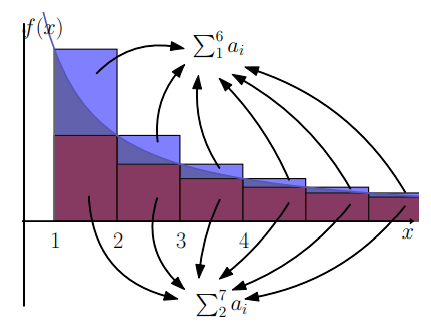
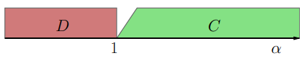

# CLASE 16 - 30/09/2025

## Integrales impropias de primera especie

### Teorema 4.11 (criterio serie-integral)

Sea $f:[k,+\infty]\to\mathbb{R}$ monótona decreciente, y $f(x)\geq0$ para todo $x$. Entonces:

- $\sum_{n=k}^{+\infty}f(n)$ y $\int_{k}^{+\infty}f(x)dx$ son de la misma clase.

#### Demostración

Supongamos que $k$ es entero, o tomamos el primer entero mayor que $k$.

Como $f$ es decreciente, en cada intervalo de la forma $[n,n+1]$ tenemos que:

$$
f(n+1)\leq f(t)\leq f(n)\quad\forall t\in[n,n+1]
$$

Si integramos en el intervalo mencionado, obtenemos que:

$$
\int_{n}^{n+1}f(n+1)dt\leq \int_{n}^{n+1}f(t)dt\leq \int_{n}^{n+1}f(n)dt\quad\forall t\in[n,n+1]
$$

Y como $f(n)$ y $f(n+1)$ son constantes:

$$
f(n+1)\leq \int_{n}^{n+1}f(t)dt\leq f(n)\quad\forall t\in[n,n+1]
$$

Y como este razonamiento es válido para todo $n$, podemos sumar desde $k$ hasta $n$, obteniendo:

$$
\sum_{n=k}^{n+1}f(n)\leq \int_{k}^{n+1}f(t)dt\leq \sum_{n=k}^{n}f(n)\quad\forall t\in[n,n+1]
$$

Marcamos las desigualdades para usarlas más adelante:

- $(*_1):\sum_{n=k}^{n+1}f(n)\leq \int_{k}^{n+1}f(t)dt$
- $(*_2):\int_{k}^{n+1}f(t)dt\leq \sum_{n=k}^{n}f(n)$

Ahora veamos una representación geométrica de lo que estamos haciendo:

Bien, ahora llamemos $F(x)=\int_{k}^{+\infty}f(t)dt$. Observar que $F$ es creciente, pues $f$ es positiva. Por lo tanto el límite de $F(x)$ cuando $x$ tiende a infinito puede ser finito (en caso de que $F$ esté acotada) o infinito (en caso de que $F$ no esté acotada). Entonces:

- Si $\sum_{n=k}^{\infty}f(n)$ es convergente, entonces sabemos que $F(x)$ está acotada por el valor de la serie (por la desigualdad $(*_2)$), por lo que $\lim_{x\to\infty}F(x)$ es finito, y entonces la integral impropia es convergente.
- Si por el contrario $\sum_{n=k}^{\infty}f(n)$ es divergente, entonces tenemos que $F(x)$ es no acotada (por la desigualdad $(*_1)$), de donde $\lim_{n\to\infty}F(x)=+\infty$, y entonces la integral impropia es divergente.

En la mayoría de los casos, es más fácil hallar una primitiva que calcular la reducida enésima, o incluso que clasificar la serie mediante otros métodos.

### Ejemplo 4.12

Tomemos $f(x)=\frac{1}{x^{\alpha}}$, con $\alpha>0$. Se puede ver que $f$ es decreciente, por lo que podemos concluir que:

- $\int_{1}^{+\infty}\frac{1}{x^{\alpha}}dx$ y $\sum\frac{1}{n^{\alpha}}$ son de la misma clase.

En particular, esto nos permite clasificar la serie para valores de $\alpha$ en $(1,2)$, que era lo que nos faltaba del capítulo pasado.

Resumiendo entonces, tanto para la integral impropia $\int_{1}^{+\infty}\frac{1}{x^{\alpha}}dx$ como para la serie $\sum\frac{1}{n^{\alpha}}$ tenemos el siguiente comportamiento:

### Ejemplo 4.13

Clasifiquemos la serie $\sum_{n=1}^{+\infty}\frac{1}{n\log(n)}$. Si tomamos la función $f:[2,+\infty)\to\mathbb{R}, f(x)=\frac{1}{x\log(x)}$, tenemos que $f$ es positiva, y decreciente (calculable viendo la derivada por ejemplo). Por otro lado, mediante un cambio de variable podemos calcular la primitiva:

$$
\begin{aligned}
&F(x)\\
&=\\
&\int_{2}^{x}\frac{1}{t\log(t)}dt\\
&=\scriptstyle{(\text{cambio de variable }u=\log(t);du=\frac{1}{t}dt)}\\
&\int_{\log(2)}^{\log(x)}\frac{1}{u}du\\
&=\\
&\log(u)\Big|_{\log(2)}^{\log(x)}\\
&=\\
&\log(\log(x))-\log(\log(2))\\
\end{aligned}
$$

Entonces observamos que $\lim_{n\to\infty}F(x)=+\infty$, entonces la integral impropia $\int_{2}^{+\infty}\frac{1}{x\log(x)}dx$ diverge, y por lo tanto:

- La serie $\sum_{n=1}^{\infty}\frac{1}{n\log(n)}$ también diverge.