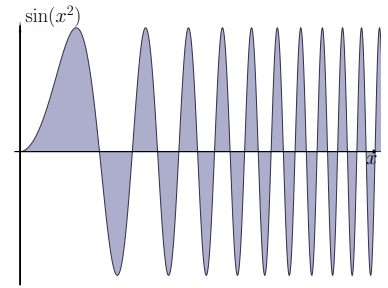

# CLASE 17 - 02/10/2025

## Integrales impropias de primera especie

### Definición 4.14

Decimos que la integral impropia $\int_{a}^{+\infty}f(x)dx$ es absolutamente convergente sii:

- $\int_{a}^{+\infty}|f(x)|dx$ es convergente

### Teorema 4.15

Si $\int_{a}^{+\infty}f(x)dx$ es absolutamente convergente, entonces también es convergente.

La demostración es "análoga" a la versión de series de este teorema, cambiando lo que haya que cambiar.

### Ejemplos 4.17

#### Ejemplo 1

Clasifiquemos la integral impropia $\int_{1}^{+\infty}\frac{sin(x)}{x^2}dx$.

Observemos que tenemos la siguiente desigualdad:

- $|\frac{sin(x)}{x^2}|\leq\frac{1}{x^2}$

Entonces podemos usar comparación, y como $\int_{1}^{+\infty}\frac{1}{x^2}dx$ es convergente, también lo es $\int_{1}^{+\infty}|\frac{sin(x)}{x^2}|dx$.

Por lo tanto probamos que $\int_{1}^{+\infty}\frac{sin(x)}{x^2}dx$ es absolutamente convergente, lo que implica que también converge por el teorema anterior.

#### Ejemplo 2

La integral $\int_{0}^{+\infty}sin(x^2)dx$ se denomina la integral de Fresnel y tiene muchas aplicaciones en física, especialmente en óptica.

Para clasificarla (primero entre $1$ y $+\infty$), podemos realizarlo con el siguiente truco:

$$
\begin{aligned}
&\int_{1}^{+\infty}sin(x^2)dx\\
&=\\
&\int_{1}^{+\infty}\frac{1}{2x}sin(x^2)2xdx\\
&=\scriptstyle{(\text{integración por partes }(*_1))}\\
&\frac{-cos(x^2)}{2x}\Big|_1^{+\infty}-\int_{1}^{+\infty}\frac{\cos(x^2)}{2x^2}dx
\end{aligned}
$$

**Observación $(*_1)$:** Lo que hacemos es lo siguiente:

$$
\begin{cases}
u=\frac{1}{2x}\to du=-\frac{1}{2x^2}\\
dv=\sin(x^2)2xdx\to v=-cos(x^2)
\end{cases}
$$

Ahora queremos verificar si los dos términos de la integral que hallamos convergen o no para determinar la convergencia de la integral original.

**Primer término:** converge

$$
\begin{aligned}
&\frac{-cos(x^2)}{2x}\Big|_1^{+\infty}\\
&=\\
&\left(\lim_{n\to\infty}\frac{-cos(x^2)}{2x}\right)+\frac{cos(1)}{2}\\
&=\scriptstyle{(\lim_{n\to\infty}\frac{-cos(x^2)}{2x}\to0)}\\
&\frac{cos(1)}{2}\\
\end{aligned}
$$

**Segundo término:** converge

$$
\begin{aligned}
&\int_{1}^{+\infty}\frac{\cos(x^2)}{2x^2}dx\text{ es absolutamente convergente}\\
&\iff\\
&\int_{1}^{+\infty}\Big|\frac{\cos(x^2)}{2x^2}\Big|dx\text{ es convergente}\\
&\iff\\
&\frac{1}{2}\int_{1}^{+\infty}\Big|\frac{\cos(x^2)}{x^2}\Big|dx\text{ es convergente}\\
\end{aligned}
$$

Y esto último se cumple por criterio de comparación, pues:

- $\Big|\frac{\cos(x^2)}{x^2}\Big|\leq\frac{1}{x^2}$

Y cómo $\int_{1}^{+\infty}\frac{1}{x^2}dx$ es convergente, $\int_{1}^{+\infty}\frac{\cos(x^2)}{2x^2}dx$ es absolutamente convergente. Y por lo tanto también es convergente.

**Resumiendo:** Con esto último podemos concluir que la integral de $1$ a $+\infty$ es convergente, y observando que la integral de $0$ a $1$ es una integral que no tiene inconvenientes (continua y en un intervalo acotado), podemos afirmar que:

- $\int_{0}^{+\infty}sin(x^2)dx$ es convergente.

## Integrales impropias de segunda especie

### Definición 4.19

Sea $f:(a,b]\to\mathbb{R}$ una función continua, y $F(x)=\int_{x}^{b}f(t)dt$. Entonces si el límite $\lim_{x\to a^+}F(x)=L<\infty$, decimos que la integral impropia $\int_{a}^{b}f(x)dx$ es convergente, y su valor es $L$. Si por el contrario el límite es infinito o no existe, decimos que la integral impropia diverge u oscila, respectivamente.

La definición cuando el dominio es $[a,b)$ es análoga.

### Ejemplo 4.20

Comencemos con $\frac{1}{x^{\alpha}}$ en $(0,1]$. Es decir, queremos clasificar $\int_{0}^{1}\frac{1}{x^{\alpha}}dx$. Calculamos entonces la primitiva:

$$
\begin{aligned}
&F(x)\\
&=\\
&\int_{x}^{1}\frac{1}{t^{\alpha}}dt\\
&=\\
&\begin{cases}\frac{t^{1-\alpha}}{1-\alpha}\Big|_x^1\quad\text{si }\alpha\neq1\\-\log(x)\quad\text{si }\alpha=1\end{cases}\\
&=\\
&\begin{cases}\frac{1-x^{1-\alpha}}{1-\alpha}\quad\text{si }\alpha\neq1\\-\log(x)\quad\text{si }\alpha=1\end{cases}\\
\end{aligned}
$$

Por lo tanto, tenemos que:

$$
\lim_{x\to0^+}F(x)=\begin{cases}
\frac{1}{1-\alpha}\quad\text{si }\alpha<1\\
+\infty\quad\text{si }\alpha\geq1
\end{cases}
$$

Y entonces la integral impropia $\int_{0}^{1}\frac{1}{x^{\alpha}}dx$ converge solamente para $\alpha<1$

### Observación

Para integrales impropias de segunda especie, tenemos los mismos resultados de comparación, equivalentes y convergencia absoluta que teníamos para las de primera especie.

### Ejemplo 4.21

Estudiemos la integral impropia $\int_{0}^{1}\frac{1}{\sqrt{x-\sin(x)}}dx$.

El único punto donde se anula el denominador es $x=0$, por lo que vamos a estudiar la función en ese punto para clasificar la integral.
Por Taylor tenemos lo siguiente:

- $\sin(x)\sim x-\frac{x^3}{3!}$

Entonces tenemos el siguiente razonamiento para el integrando:

$$
\begin{aligned}
&\int_{0}^{1}\frac{1}{\sqrt{x-\sin(x)}}dx\\
&\sim\\
&\int_{0}^{1}\frac{1}{\sqrt{x-(x-\frac{x^3}{3!})}}dx\\
&\sim\\
&\int_{0}^{1}\frac{1}{\sqrt{\frac{x^3}{3!}}}dx\\
&\sim\\
&\int_{0}^{1}\frac{1}{\sqrt{x^3}}dx\\
&\sim\\
&\int_{0}^{1}\frac{1}{x^{\frac{3}{2}}}dx\\
\end{aligned}
$$

Por lo tanto, de acuerdo a lo visto en el ejemplo 4.20, esta integral diverge por el criterio de equivalentes.

## Integrales mixtas

Cuando en una integral aparece mas de punto problemático (o dominio infinito), debemos partir la integral en suma de integrales que contengan solamente uno de esos puntos, y decimos que la integral original es convergente sii cada uno de los sumandos lo es.

### Ejemplo 4.23

La integral impropia $\int_{0}^{+\infty}\frac{1}{x^{\alpha}}dx$ tiene que partirse en dos (pues en 0 no es acotada y el dominio es infinito). Entonces:

- $\int_{0}^{+\infty}\frac{1}{x^{\alpha}}dx=\int_{0}^{1}\frac{1}{x^{\alpha}}dx+\int_{1}^{+\infty}\frac{1}{x^{\alpha}}dx$

Pero observemos que la primera solo converge si $\alpha<1$, y la segunda solo si $\alpha>1$

### Ejemplo 4.24

Queremos clasificar $\int_{-\infty}^{+\infty}xdx$, por lo tanto por la definición tenemos que separar en:

- $\int_{-\infty}^{+\infty}xdx=\int_{-\infty}^{0}xdx+\int_{0}^{+\infty}xdx$

De donde claramente podemos verificar que la integral diverge, pues ambos sus integrandos divergen.