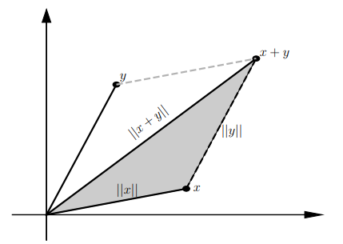
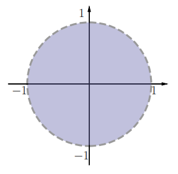
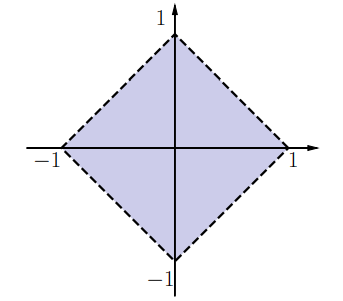
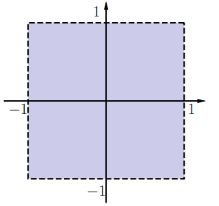

# CLASE 18 - 20/10/2025

## Topología en $\mathbb{R}^n$

### Definición 5.1 (norma)

Decimos que una función $\|\cdot\|:\mathbb{R}^n\to\mathbb{R}$ es una *norma* si verifica las siguientes tres propiedades:

1. $\|x\|\geq0$, y $\|x\|=0$ solamente si $x=0$.
2. $\|\lambda x\|=|\lambda|\|x\|$, para todo $\lambda\in\mathbb{R}$
3. $\|x+y\|\leq\|x\|+\|y\|$ que se denomina la desigualdad triangular

Veamos un ejemplo visual de como funciona la desigualdad triangular:

#### Ejemplos

1. Norma euclidea $\|.\|_2$ (o norma dos):
    - Sea $x\in\mathbb{R}^n$, entonces la norma euclidea se define por $\|x\|=\sqrt{x_1^2+x_2^2+\ldots+x^n}$

    Esta norma es la que solemos usar en general.
2. Norma uno $\|.\|_1$:
    - Sea $x\in\mathbb{R}^n$, entonces la norma euclidea se define por $\|x\|_1=|x_1|+|x_2|+\ldots+|x_n|$

    Esto se puede generalizar para cualquier $p\in\mathbb{N}$:
3. Norma $p$ $\|.\|_p$:
    - Sea $x\in\mathbb{R}^n$, entonces la norma euclidea se define por $\|x\|_p=\sqrt[p]{|x_1|^p+|x_2|^p+\ldots+|x_n|^p}$
4. Norma infinito $\|.\|_{\infty}$
    - Sea $x\in\mathbb{R}^n$, entonces la norma euclidea se define por $\|x\|_{\infty}=\max\{|x_1|,|x_2|,\ldots,|x_n|\}$

Veamos ahora como se define una función distancia.

### Definición 5.2 (distancia)

Decimos que una función $\mathbb{R}^n\times\mathbb{R}^n\to\mathbb{R}$ es una distancia si verifica las siguientes propiedades:

1. $d(x,y)\geq0$, y $d(x,y)=0$ sii $x=y$
2. $d(x,y)=d(y,x)$ para todo $x,y\in\mathbb{R}^n$
3. $d(x,y)\leq d(x,z)+d(z,y)$

Podemos ver que si tenemos una norma, podemos definir una función distancia de la siguiente forma:

- $d(x,y)=\|x-y\|$

En general, trabajaremos con la distancia dada por la norma euclidea, aunque distintas normas o distancias tienen distintas aplicaciones en las que pueden ser más prácticas que las que usamos normalmente.

### Definición 5.3 (bola abierta)

Dado un punto $a\in\mathbb{R}^n$ y un número real positivo $\delta$, llamamos bola abierta (o entorno, o simplemente bola) de centro $a$ y radio $\delta$ al conjunto:

$$
B(a,\delta)=\{x\in\mathbb{R}^n:d(x,a)<\delta\}
$$

Tenemos entonces que $B(a,\delta)$ es el conjunto de puntos de $\mathbb{R}^n$ que se encuentran a distancia menor que $\delta$.
Esto claramente depende de que noción de distancia estamos usando.

#### Ejemplos en $\mathbb{R}^2$

1. Considerando la distancia tradicional, la que se deriva de la norma euclidea, tenemos que $B(0,1)$ es representado de la siguiente forma en el plano:

    

2. Considerando la distancia derivada de la norma $\|.\|_1$, $B(0,1)$ es representado de la siguiente forma en el plano:

    

3. Considerando la distancia derivada de la norma $\|.\|_1$, $B(0,1)$ es representado de la siguiente forma en el plano:

    

### Definición 5.5

Sea $A$ un conjunto, y denotamos por $A^C$ su complemento. Entonces decimos que:

- un punto $x_0$ **es interior** a $A$ sii existe una bola $B(x_0,\delta)\subset A$
- un punto $x_0$ **es exterior** a $A$ sii existe una bola $B(x_0,\delta)\subset A^C$
- un punto $x_0$ **es frontera** de $A$ sii toda bola interseca a $A$ y $A^C$ (es decir que $\forall\delta>0: A\cap B(x_0,\delta)\neq\emptyset\land A^C\cap B(x_0,\delta)\neq\emptyset$)

Observemos que ser un punto frontera es exactamente la definición de no ser ni interior ni exterior.
Por la definición está claro que los puntos interiores necesariamente pertenecen al conjunto $A$, mientras que los exteriores necesariamente pertenecen al conjunto $A^C$. Sin embargo no podemos concluir mucho sobre los puntos frontera.

### Ejemplos 5.6

#### Ejemplo 1

Consideremos el conjunto $A_1=\{(x_1,x_2): x_2\geq0\}$, es decir el semiplano superior. Entonces:

- Cualquier punto $(x_1,x_2)$ con $x_2>0$ es interior.
- Cualquier punto $(x_1,x_2)$ con $x_2<0$ es exterior.
- Cualquier punto $(x_1,x_2)$ con $x_2=0$ es un punto frontera.

#### Ejemplo 2

Consideremos el conjunto $A_2=\{(x_1,x_2)\in\mathbb{R}^2:0<x_1<1, x_2=0\}$. Entonces:

- No hay puntos interiores, ya que no puede haber una bola de radio positivo incluida en un segmento.
- Todos los puntos del conjunto son puntos frontera.
- El $(0,0)$ y $(1,0)$ también son puntos frontera a pesar de no pertenecer al conjunto.