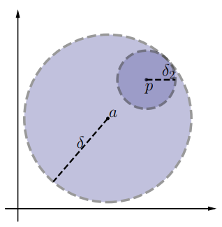

# CLASE 19 - 21/10/2025

## Topología en $\mathbb{R}^n$

### Ejemplos 5.6

#### Ejemplo 3

Consideremos el conjunto $A_3=\{(x_1,y_1)\in\mathbb{R}^2: 0<x_1<1; 0<x_2<1\}$. Entonces cualquier punto del conjunto es interior. En efecto, si $p=(x_0,y_0)$ es un punto de $A_3$, entonces si tomamos $\delta=\{x_0,1-x_0,y_0,1-y_0\}$, la bola de centro $p$ y radio $\delta$ está completamente incluida en $A_3$.
Ese $\delta$ que tomamos es la distancia más corta de $p$ a alguno de los bordes del cuadrado.

Cuando se da el caso de este último ejemplo, donde todos los puntos del conjunto son interiores, decimos que el conjunto es abierto.

### Definición 5.7 (conjunto abierto)

Un conjunto es abierto sii todos sus puntos son interiores.

**Observación:** Los conjuntos $\emptyset$ y $\mathbb{R}^n$ son conjuntos abiertos.

### Proposición 5.8

La bola abierta $B(a,\delta)$ es un conjunto abierto.

#### Demostración

Queremos demostrar que todos los puntos de $B(a,\delta)$ son interiores. Para esto tomaremos un punto genérico $p\in B(a,\delta)$ y encontraremos una bola de centro $p$ completamente incluida en $B(a,\delta)$.

Tomemos $\delta_2=\delta-d(a,p)$, queremos verificar que $B(p,\delta_2)$ está completamente incluida en $B(a,\delta)$. 
Para esto consideramos $z\in B(p,\delta_2)$ genérico, y queremos verificar que $z\in B(a,\delta)$.
Por la desigualdad triangular tenemos que:

- $d(a,z)\leq d(a,p)+d(p,z)$

Pero como $d(p,z)<\delta_2=\delta-d(a,p)$, tenemos que:

- $d(a,z)< \cancel{d(a,p)}+\delta-\cancel{d(a,p)}$

Entonces cualquier el punto $z$ está a distancia menor que $\delta$ de $a$. Esto significa que $z\in B(a,\delta)$, que es lo que queríamos probar en primer lugar.

**Observación:** La demostración no depende de la noción de distancia que estemos usando.

Gráficamente lo que verificamos es lo siguiente:

### Proposición 5.9

Si $A$ y $B$ son conjuntos abiertos, entonces $A\cap B$ es abierto.

#### Demostración

Tomemos un punto $p$ en la intersección, y veamos si es interior a $A\cap B$.
Como $p\in A\cap B$, tenemos que:

- $p\in A \to \exists\delta_A$ tal que $B(p,\delta_A)\subset A$ (pues $A$ es abierto).
- $p\in B \to \exists\delta_B$ tal que $B(p,\delta_B)\subset B$ (pues $B$ es abierto).

Por lo tanto, si tomamos $\delta:=\min\{\delta_A,\delta_B\}$, tenemos que:

- $B(p,\delta)\subseteq B(p,\delta_A)\subset A$
- $B(p,\delta)\subseteq B(p,\delta_B)\subset B$

Entonces la bola $B(p,\delta)$ está completamente incluida en $A$ y en $B$, por lo que podemos concluir que:

- $B(p,\delta)\subset A\cap B$

Lo que significa que $p$ es un punto interno del conjunto $A\cap B$, y esto vale para cualquier punto ya que tomamos uno genérico.

**Observación:** Es fácil ver que esta proposición se extiende para la intersección de cualquier cantidad de conjuntos finita. 
Ahora, si la cantidad de conjuntos fuera infinita, este razonamiento no es válido porque no necesariamente está bien definido el mínimo de los $\delta$ para cada conjunto.

### Proposición 5.10

Sea $(A_{\lambda})_{\lambda\in\mathcal{L}}$ una familia de conjuntos abiertos, $A_{\lambda}\subset\mathbb{R}^n$. Entonces su unión $\bigcup_{\lambda\in\mathcal{L}}A_{\lambda}$ es también un conjunto abierto.

#### Demostración

Consideremos un punto cualquiera $p\in\bigcup_{\lambda\in\mathcal{L}}A_{\lambda}$. Como $p$ pertenece a la unión de los $A_{\lambda}$, en particular pertenece a al menos uno. Llamemosle $A_{\lambda_0}$ a este conjunto.

Por otra parte, como $p\in A_{\lambda_0}$ y $A_{\lambda_0}$ es abierto, tenemos que:

- $B(p,\delta)\subset A_{\lambda_0}$

Y como $A_{\lambda_0}\subset\bigcup_{\lambda\in\mathcal{L}}A_{\lambda}$, podemos concluir que:

- $B(p,\delta)\subset\bigcup_{\lambda\in\mathcal{L}}A_{\lambda}$

Que significa que $p$ es un punto interno, y como asumimos $p$ genérico este razonamiento vale para cualquier $p$, con lo que concluimos que $\bigcup_{\lambda\in\mathcal{L}}A_{\lambda}$ es abierto.

### Definición 5.11

Decimos que un conjunto es cerrado sii su complemento es abierto.

### Ejemplos 5.13

1. El conjunto formado por un punto $A=\{p\}$ es un conjunto cerrado.
2. El conjunto $\overline{B(p,\delta)}=\{x\in\mathbb{R}^n: d(p,x)\leq\delta\}$ es un conjunto cerrado. Es lo equivalente a una bola abierta pero también con la circunferencia.
3. La esfera $S^{n-1}=\{x\in\mathbb{R}^n:\|x\|=1\}$ es un conjunto cerrado. Cuando $n=2$ obtenemos la circunferencia unidad.