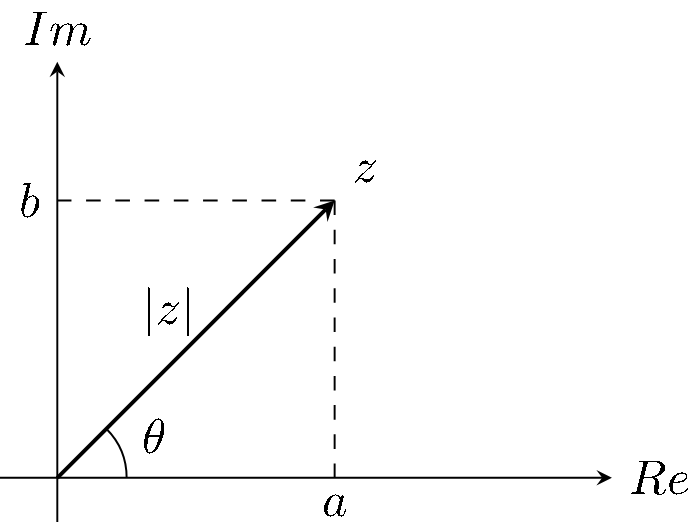
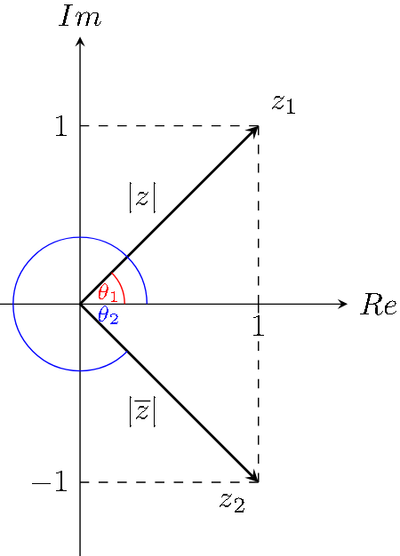
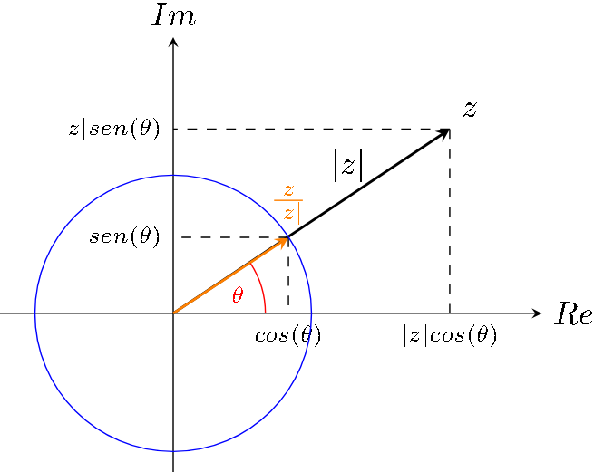

# Clase 2

## Números complejos

### Recordatorio: funciones trigonométricas

Recordemos que:

- $sen(\theta)=\frac{op}{hip}$
- $cos(\theta)=\frac{ady}{hip}$
- $tan(\theta)=\frac{op}{ady}$

### Obteniendo partes real e imaginaria a partir de módulo y ángulo

Volviendo a la imagen de la clase pasada:

Observemos que se cumple lo siguiente:

- $cos(\theta)=\frac{a}{|z|}$, y
- $sen(\theta)=\frac{b}{|z|}$

De donde podemos derivar que:

- $a=|z|\cdot cos(\theta)$, y
- $b=|z|\cdot sen(\theta)$

### Propiedades del módulo

1. $|z|\geq 0$, además $|z|=0\leftrightarrow z=0$
2. $|Re(z)|\leq|z|$ y $|Im(z)|\leq|z|$
3. $|z\cdot w| = |z||w|$ y si $w\neq0$ entonces $|\frac{z}{w}|=\frac{|z|}{|w|}$
4. $|z+w|\leq|z|+|w|$

### Manejo de complejos en las diferentes notaciones

#### Ejemplo 1

Calculemos el módulo y ángulo del siguiente complejo:

- $z_1=1$
- $|z_1|=\sqrt{1}=1$
- $\theta=0$

#### Ejemplo 2

Calculemos el módulo y ángulo del siguiente complejo:

- $z_2=-1$
- $|z_2|=\sqrt{1}=1$
- $\theta=\pi$

#### Ejemplo 3

Calculemos el módulo y ángulo del siguiente complejo:

- $z_3=i$
- $|z_3|=\sqrt{1}=1$
- $\theta=\frac{\pi}{2}$

#### Ejemplo 4

Calculemos el módulo y ángulo del siguiente complejo:

- $z_4=-i$
- $|z_4|=\sqrt{1}=1$
- $\theta=\frac{-\pi}{2}$

#### Ejemplo 5

Calculemos el módulo y ángulo del siguiente complejo:

- $z_5=1-i$
- $|z_5|=\sqrt{2}$
- $\theta=\frac{-\pi}{4}$

#### Observación

Siempre para este tipo de cosas, pensar en la representación gráfica, esto ayuda para calcular el ángulo en la mayoría de los casos.

### Definición (complejo conjugado)

Dado $z=a+bi$ definimos su conjugado como $\overline{z}=a-bi$

#### Observación

- $|z|=|\overline{z}|$ y,
- $z$ y $\overline{z}$ tienen ángulos opuestos

#### Propiedades del complejo conjugado

1. $\overline{z+w}=\overline{z}+\overline{w}$
2. $\overline{z\cdot w}=\overline{z}\cdot\overline{w}$
3. $z+\overline{z}=2Re(z)$
4. $z-\overline{z}=i2Im(z)$
5. $\overline{\overline{z}}=z$
6. $z\overline{z}=|z|^2$

##### Observación

Todas las propiedades son triviales menos la última, que se deriva de:

$$
\begin{aligned}
(a+bi)(a-bi)&=a^2-abi+abi-bi^2\\
&= a^2-bi^2\\
&= a^2+b^2\\
&= |z|^2
\end{aligned}
$$

#### División entre complejos usando el conjugado

El conjugado es una herramienta muy útil cuando queremos dividir dos complejos, esto porque vimos que $z\overline{z}=|z|^2$, que es un número real.
Veamos un ejemplo:

- $z_1=2+i$
- $z_2=1-i$

$$
\begin{aligned}
\frac{2+i}{1-i}&=\frac{2+i}{1-i}\cdot\frac{1+i}{1+i}\\
&=\frac{2+2i+i+i^2}{2}\\
&=\frac{1+3i}{2}\\
&=\frac{1}{2}+\frac{3}{2}i
\end{aligned}
$$

### Círculo trigonométrico y relación con el argumento y módulo

Consideremos $\theta$ un número real cualquiera, sea $z=cos\theta+isen\theta$

Al graficarlo, vamos a observar dos cosas inmediatamente:

- $|z|=\sqrt{cos^2\theta+sen^2\theta}=1$
- $\theta$ es el argumento de $z$

Con esto en mente, podemos construir cualquier $z\in\mathbb{C}$ tal que $|z|=1$ utilizando esta forma.

Ahora, observando que $\forall z\in\mathbb{C}:|\frac{z}{|z|}|=1$, podemos construir cualquier complejo $z$ a partir de lo siguiente:

$$
\begin{aligned}
\frac{z}{|z|}&=cos^2\theta+isen^2\theta\\
&=|z|(cos^2\theta+isen^2\theta)
\end{aligned}
$$

### Exponencial compleja

Queremos definir una función $f:\mathbb{C}\to\mathbb{C}$ que extienda la exponencial real que ya conocemos.

Dado $z=a+bi$, definimos:

- $e^z=e^a(cos(b)+isen(b))$

#### Observación 1

Sea $z=a+bi$, entonces el módulo de $e^z$ es:

$$
\begin{aligned}
|e^z|&=|e^a(cos(b) + isen(b))|\\
&= |e^a|\cdot|cos(b)+isen(b)|\\
&= |e^a|\cdot1\\
&= e^a
\end{aligned}
$$

Como $e^a$ es real, entonces también sabemos que el ángulo de $e^z$ es $b$.

#### Observación 2

Veamos ahora que la definición que dimos de $e^z$ para los complejos, efectivamente extiende la definición que conocemos de la exponencial real.
Sea $z=a+0i$, entonces:

$$
\begin{aligned}
e^z&=e^a(cos(0)+isen(0))\\
&= e^a
\end{aligned}
$$

Por lo que efectivamente, extiende a la función exponencial real.

#### Proposición

Si $z=a+bi$ y $w=c+di$, entonces:

- $e^{z+w}=e^z+e^w$

##### Demostración

Por un lado tenemos que:

- $z+w=a+c+(b+d)i$, entonces
- $e^{z+w}=e^{a+c}(cos(b+d)+isen(b+d))$

Ahora del otro lado, tenemos que:

$$
\begin{aligned}
&e^ze^w\\
&=\scriptstyle{(\text{desarrollo})}\\
&e^a(cos(b)+isen(b))\cdot e^c(cos(d)+isen(d))\\
&=\scriptstyle{(a,c\text{ son reales, propiedad de exponencial real})}\\
&e^{a+c}(cos(b)+isen(b))\cdot(cos(d)+isen(d))\\
&=\scriptstyle{(\text{distributiva y agrupación de términos})}\\
&e^{a+c}((cos(b)cos(d)-sen(b)sen(d))+i(cos(b)sen(d)+sen(b)cos(d)))\\
&=\scriptstyle{(\text{propiedades trigonométricas})}\\
&e^{a+c}(cos(b+d)+isen(b+d))\\
\end{aligned}
$$

Por lo que queda demostrado que también tenemos la propiedad fundamental de la función exponencial para complejos.

**Observación:** Las propiedades trigonométricas utilizadas en el último paso son:

- $cos(a)cos(b)-sen(a)sen(b)=cos(a+b)$
- $cos(a)sen(b)+sen(a)cos(b)=sen(a+b)$

Estas son las fórmulas para el seno y coseno de la suma.

#### Notación polar

Si $z$ es un complejo de módulo $|z|=\varrho$ y ángulo $\theta$, entonces:

- $z=\varrho e^{i\theta}$

Llamamos a esta notación, la notación polar.

##### Observación

Sean $z_1=\varrho_1 e^{i\theta_1}$ y $z_2=\varrho_2 e^{i\theta_2}$, entonces multiplicarlos resulta en lo siguiente:

$$
\begin{aligned}
z_1\cdot z_2&=\varrho_1 e^{i\theta_1}\cdot\varrho_2 e^{i\theta_2}\\
&=\varrho_1\varrho_2e^{i\theta_1}e^{i\theta_2}\\
&=\varrho_1\varrho_2e^{i(\theta_1+\theta_2)}
\end{aligned}
$$

Por lo que el producto se transforma en una operación muy sencilla en esta notación:

- Multiplico los módulos
- Sumo los ángulos