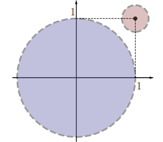

# CLASE 20 - 22/10/2025

## Topología en $\mathbb{R}^n$

### Observación #1

Si $x_0$ es frontera de $A$, entonces también es frontera de $A^C$, para cualquier conjunto.
Esto significa, que los conjuntos $A$ y $A^C$ comparten la frontera.

### Observación #2

Si $A$ es un conjunto cerrado y $x_0$ es un punto frontera, entonces $x_0\in A$, pues no puede pertenecer a $A^C$ que es abierto.

### Definición 5.15

Dado un conjunto $A\subset\mathbb{R}^n$, decimos que $p\in\mathbb{R}^n$ es un punto de acumulación de $A$ sii toda bola reducida corta al conjunto, es decir:

- $\forall\varepsilon>0: B^*(p,\varepsilon)\cap A\neq\emptyset$

**Observación:** La bola reducida es lo mismo que la bola abierta, excluyendo el punto central.

El concepto de punto de acumulación es, como ya vimos anteriormente en el curso, que nos podemos acercar al punto tanto como queramos con elementos del conjunto.
Por ejemplo todos los puntos interiores $p$ de un conjunto son de acumulación, pues existe una bola abierta centrada en $p$ totalmente contenida en el conjunto.

### Ejemplo 5.17

Consideremos el conjunto $A=B(0,1)\cup\{(1,1)\}$.
El punto $(1,1)$ es un punto frontera, pero "no tiene del conjunto a nadie alrededor". Efectivamente, si tomamos una bola reducida de centro $(1,1)$ con un radio pequeño, esta no contiene ningún elemento del conjunto como vemos en la imagen.

En general, estos puntos $p$ donde existe una bola $B(p,\delta)$ tal que el único punto del conjunto en esa bola es $p$, se llaman puntos aislados. Son puntos frontera, pero no de acumulación.

### Proposición 5.18

Un conjunto $C$ es cerrado sii $C$ contiene a todos sus puntos de acumulación.

#### Demostración

**Parte 1: $(\rightarrow)$**

(H) $C$ es un conjunto cerrado.
(T) $C$ contiene a todos sus puntos de acumulación.

Sea $p$ un punto de acumulación de $C$ tal que $p\notin C$. Entonces $p\in C^C$, como $C$ es cerrado, tenemos que $C^C$ es abierto.
Por lo tanto $p$ es un punto interior de $C^C$, lo que significa que:

- $\exists\delta>0:B(p,\delta)\subset C^C$

Entonces para este $\delta$, tenemos que $B^*(p,\delta)\cap C=\emptyset$. Lo que niega la definición de punto de acumulación, por lo que esto es absurdo.
Esto prueba el directo.

**Parte 1: $(\leftarrow)$**

(H) $C$ contiene a todos sus puntos de acumulación.
(T) $C$ es un conjunto cerrado.

Para probar que $C$ es cerrado, tenemos que probar que $C^C$ es abierto, es decir que para un $p\in C^C$ cualquiera, $p$ tiene que ser interior.
Por hipótesis, $p$ no puede ser un punto de acumulación de $C$, por lo que se cumple lo siguiente para $p$ (negación de definición de punto de acumulación):

- $\exists\varepsilon>0: B^*(p,\varepsilon)\cap C=\emptyset$

Que significa que existe una bola reducida de centro $p$ completamente contenida en $C^C$ (pues no interseca con $C$). Esto es la definición de punto interior de $C^C$ a excepción de que falta que el centro también pertenezca (pues consideramos la bola reducida).
Entonces consideremos las siguientes afirmaciones:

- $B^*(p,\varepsilon)\subset C^C$
- $p\in C^C$

Juntando, tenemos que:

- $B(p,\varepsilon)\subset C^C$

Por lo que $p$ es interior, y como consideramos $p$ cualquier esto vale para todo punto de $C^C$, con lo que concluimos que:

- $C^C$ es abierto, por lo que $C$ es cerrado.

Esto prueba el recíproco y por tanto la proposición.

### Notación

Sea $A\subset \mathbb{R}^n$ un conjunto. Llamamos:

- $\mathring{A}$ al conjunto de puntos interiores.
- $\partial A$ al conjunto de puntos frontera.
- $A'$ al conjunto de puntos de acumulación de $A$.
- $\overline{A}=A\cup\partial A$ al conjunto clausura de $A$.

Teniendo en cuenta esta notación, podemos reescribir algunas definiciones de forma más breve:

- Un conjunto $A$ es abierto sii $A=\mathring{A}$
- Un conjunto es cerrado si $A=\overline{A}$

### Ejemplo 5.19

En el plano, consideremos el siguiente conjunto:

- $A=\{(x,y)\in\mathbb{R}^2:y=0,x=\frac{1}{n}/n\in\mathbb{N}\}$

Entonces tenemos que:

- $\mathring{A}=\emptyset$
- $\partial A= A\cup \{(0,0)\}$
- $A'=\{(0,0)\}$
- $\overline{A}=\partial A$

**Observación:** Graficar en este tipo de ejercicios siempre es una muy buena idea, por lo general nos da una noción de como funciona el conjunto.

### Definición 5.20

Decimos que un conjunto $A$ es acotado si existe $K>0$ tal que $A\subset B(0,K)$. Es decir, si podemos incluir al conjunto en alguna bola de centro 0.

Podemos observar que esta definición en $\mathbb{R}$ coincide con la noción que teníamos de acotación.

### Definición 5.21

Decimos que un conjunto es compacto si es cerrado y acotado.

### Ejemplos 5.22

1. La bola cerrada $\overline{B(0,1)}$ es un conjunto compacto.
2. Si $A$ es un conjunto acotado, entonces también lo es $\overline{A}$