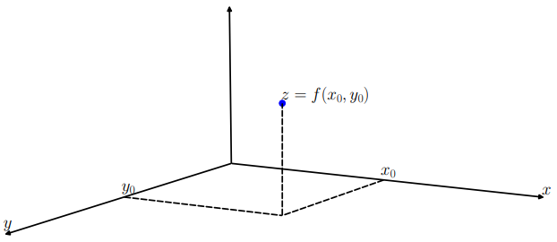
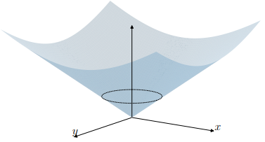

# CLASE 22 - 28/10/2025

## Funciones en $\mathbb{R}^n$

Recordemos que una función consta de tres elementos: un dominio, un codominio y una regla que a cada elemento del dominio, le asigna uno del codominio.
Trabajaremos fundamentalmente con funciones $f:\mathbb{R}^n\to\mathbb{R}$, veamos algunos ejemplos que ya conocemos.

### Ejemplos 6.1 (dominio $\mathbb{R}^2$)

#### Ejemplo 1

Las normas con las que trabajamos en el capítulo anterior son funciones que toman valores reales (positivos específicamente):

$$
f_1(x,y)=\|(x,y)\|_1=|x|+|y|\\
f_2(x,y)=\|(x,y)\|_2=\sqrt{x^2+y^2}\\
$$

#### Ejemplo 2

Otras clases de funciones conocidas son las transformaciones lineales. En particular un ejemplo como:

$$
f_3(x,y)=2x-3y
$$

#### Ejemplo 3

Podemos también definir una función en el plano de forma arbitraria como:

$$
f_4(x,y)=e^{x^2y}+\sin(x+y)+1
$$

### Representación gráfica de una función

Si queremos representar una función $f:\mathbb{R^2}\to\mathbb{R}$, lo debemos hacer en el espacio tridimensional $\mathbb{R}^2\times\mathbb{R}$.
Considerando las coordenadas de este espacio como $(x,y,z)$, usaremos el "piso" para representar el dominio y la "altura" para representar las imágenes de la función.

Notemos que cuando trabajabamos con funciones de $\mathbb{R}$ en $\mathbb{R}$ la figura que obteníamos al graficar era una curva, es fácil observar que al trabajar en funciones de $\mathbb{R^2}$ en $\mathbb{R}$ estas resultan en una superficie de "dimensión dos".
Veamos una herramienta para obtener información parcial sobre la forma del gráfico de una función.

#### Conjuntos de nivel

Los conjuntos de nivel son subconjuntos del dominio, cuyos puntos tienen la misma imagen por la función.
Dado un número $k\in\mathbb{R}$, el conjunto de nivel de $k$ es:

- $C_k=\{(x,y)\in\mathbb{R}^2: f(x,y)=k\}$

Tomemos por ejemplo la función $f(x,y)=x^2+y^2$. La curva de nivel $k=1$ son los puntos $(x,y)$ del plano tales que $f(x,y)=1$.
Veamoslo gráficamente, mostrando los conjuntos de nivel en el plano (primera imagen), y luego gráficandolos en la altura correspondiente al nivel que representan.

Otra forma de obtener información adicional es observando cortes complementarios. Por ejemplo, podemos ver cómo es el comportamiento cuando $y=0$, es decir estudiar $f(x,0)$.
En el caso de $f(x,y)=x^2+y^2$, resulta $f(x,0)=x^2$. Tenemos entonces que el corte de la superficie-gráfico con el plano $y=0$ es una parábola. Lo mismo ocurre si trabajamos con el plano $x=0$. El gráfico de esta función tiene como nombre paraboloide.

Sin embargo, cuando consideramos la función $f(x,y)=\sqrt{x^2+y^2}$, al cortar con el plano $y=0$, resulta $f(x,0)=\sqrt{x^2}=|x|$. Lo mismo ocurre con el plano $x=0$. Observemos que los conjuntos de nivel son circunferencias, por lo que el gráfico es como un cono:

## Límites y continuidad

### Definición 6.4 (límite)

Dado un conjunto $D\subset\mathbb{R}^n$, una función $f:D\to\mathbb{R}$ y $a\in\mathbb{R}^n$ un punto de acumulación de $D$, decimos que:

$$
\begin{aligned}
&\lim_{x\to a} f(x)=L\\
&\iff\\
&\forall\varepsilon>0,\exists\delta>0\text{ tal que }\forall x\in B^*(a,\delta)\cap D\text{ se cumple }f(x)\in B(L,\varepsilon)\\
\end{aligned}
$$

Observemos que no necesitamos que la función esté definida en el punto $a$, e incluso si está definida en ese punto, no influye en la definición.

### Definición 6.5 (continuidad)

Dado un conjunto $D\subset\mathbb{R}^n$ una función $f:D\to\mathbb{R}$, y $a\in\mathbb{R}^n$ un punto de $D$, decimos que $f$ es continua en $a$ sii:

$$
\forall\varepsilon>0,\exists\delta>0\text{ tal que }\forall x\in B(a,\delta)\cap D\text{ se cumple }f(x)\in B(f(a),\varepsilon)
$$

### Observación 6.6

El punto $a$ debe estar en el dominio (en particular porque calculamos $f(a)$), pero no necesariamente debe ser un punto de acumulación. Así podemos distinguir dos casos:

1. Si $a$ es un punto de acumulación de $D$, entonces la definición de continuidad coincide con la de límite, con $L=f(a)$. Es decir, en ese caso:

$$
f\text{ es continua en }a\iff\lim_{x\to a}f(x)=f(a)
$$

2. Si $a$ no es un punto de acumulación de $D$, entonces es un punto aislado. Es decir existe un radio $\delta>0$ tal que no hay puntos de $D$ en $B(a,\delta)$. Entonces una función $f$ siempre será continua en los puntos aislados del dominio.

