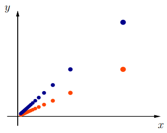

# CLASE 24 - 03/11/2025

## Límites y continuidad

### Teorema 6.8

Sea un conjunto $D\subset\mathbb{R}^n$, una función $f:D\to\mathbb{R}$, y $a\in\mathbb{R}^n$ un punto de acumulación de $D$. Entonces:

- $\lim_{x\to a} f(x)=L\iff$ para toda sucesión $x_k$ de elementos de $D\setminus\{a\}$ tal que $\lim_{k\to+\infty}x_k=a$, tenemos que $\lim_{k\to+\infty} f(x_k)=L$

### Teorema 6.9

Sea un conjunto $D\subset\mathbb{R}^n$, una función $f:D\to\mathbb{R}$, y $a\in\mathbb{R}^n$ un punto de $D$. Entonces:

- $f$ es continua $\iff$ para toda sucesión $x_k$ de elementos de $D$ tal que $\lim_{k\to+\infty}x_k=a$, tenemos que $\lim_{k\to+\infty} f(x_k)=f(a)$

#### Demostración

##### Directo $(\rightarrow)$

(H) $f$ es continua
(T) para toda sucesión $x_k$ de elementos de $D$ tal que $\lim_{k\to+\infty}x_k=a$, tenemos que $\lim_{k\to+\infty} f(x_k)=f(a)$

Consideremos una sucesión genérica $x_k\subset D$ tal que $\lim_{k\to+\infty}x_k=a$. Queremos probar que $\lim_{k\to+\infty} f(x_k)=f(a)$.

Por hipótesis, tenemos que $f$ es continua, es decir que para todo punto $a\in D$, se cumple que:

- $\forall\varepsilon>0,\exists\delta>0$ tal que $\forall x\in B(a,\delta)\cap D$ se cumple $f(x)\in B(f(a),\varepsilon)$

Entonces llamamos $\delta_{\varepsilon}>0$ a los $\delta_{\varepsilon}$ que cumple con la definición.

Por otra parte, tenemos que la sucesión converge a $a$, es decir que:

- $\forall\delta>0,\exists k_0\in\mathbb{N}$ tal que $\forall k>k_0: a_k\in B(a, \delta)$

En particular, esto es cierto para $\delta_{\varepsilon}$, por lo que tenemos que a partir de un cierto $k_0$ en la sucesión, la misma $a_k$ se encuentra encerrada en la bola $B(a,\delta)$.
Entonces como se encuentra encerrada en $B(a,\delta)$, podemos aplicar la definición de continuidad para concluir que $\forall k>k_0$ se cumple que $f(x_k)\in B(f(a),\varepsilon)$. Lo cual significa que:

- $\lim_{x_k\to\infty}f(x_k)=f(a)$

##### Recíproco $(\leftarrow)$

(H) para toda sucesión $x_k$ de elementos de $D$ tal que $\lim_{k\to+\infty}x_k=a$, tenemos que $\lim_{k\to+\infty} f(x_k)=f(a)$
(T) $f$ es continua

Supongamos por absurdo, que $f$ no es continua, esto es que para todo $a\in D$, se cumple que:

- $\exists\varepsilon>0,\forall\delta>0$ tal que $\exists x\in B(a,\delta)\cap D$ para el que se cumple $f(x)\notin B(f(a),\varepsilon)$ (negación de continuidad)

Al fijar este $\varepsilon>0$, podemos considerar $\delta_k=\frac{1}{k}$ para formar una sucesión $a_k$ tomando el punto $x_k\in B(a,\delta)\cap D$ que nos da la negación de continuidad para el cual se cumple:

- $f(x_k)\notin B(f(a),\varepsilon)$

Tomando infinitos de estos puntos, tenemos la sucesión $x_k$ que converge a $a$ por construcción.
Pero también por construcción, para todo $k$ se cumple que $f(x_k)$ está arbitrariamente lejos de $f(a)$.

Esto significa que $\lim_{k\to+\infty} f(x_k)\neq f(a)$, lo cual es absurdo pues contradice la hipótesis.
Con esto concluimos que $f$ tiene que ser continua

### Ejemplo 6.10

Consideremos $f:\mathbb{R}^2\to\mathbb{R}$ definida como $f(x,y)=x^3y^2e^{x-y}$, e intentemos calcular $\lim_{x\to(0,0)}f(x,y)$

Tenemos dos herramientas hasta ahora para poder calcular este límite, una es la definición (muy tedioso en general), mientras que la otra es caracterizar el límite usando sucesiones.

Tomamos una sucesión genérica (pues queremos usar el recíproco del teorema 6.9) que sea convergente al origen: $(x_k,y_k)\to(0,0)$.

Veamos entonces la sucesión real $f(x_k,y_k)=x_k^3y_k^2e^{x_k-y_k}$ cuando $x_k\to0$ e $y_k\to0$:

$$
\begin{aligned}
&\lim_{x_k\to0, y_k\to0}x_k^3y_k^2e^{x_k-y_k}\\
&=\\
&0\cdot0e^{0-0}\\
&=\\
&0
\end{aligned}
$$

Como tomamos una sucesión genérica (MUY IMPORTANTE), podemos concluir que $\lim_{x\to(0,0)}f(x,y)=0$

### Ejemplo 6.11

Veamos otro ejemplo. Consideremos la función $f:\mathbb{R}^2\setminus(0,0)\to\mathbb{R}$, definida como $f(x,y)=\frac{xy}{x^2+y^2}$ y estudiaremos el límite en $(0,0)$.

Nuevamente consideraremos una sucesión genérica $(x_k,y_k)\to(0,0)$ y estudiamos su imagen:

$$
f(x_k,y_k)=\frac{x_ky_k}{x_k^2+y_k^2}
$$

Observamos rápidamente que cuando $(x_k,y_k)\to (0,0)$ el denominador tiende a $0$, por lo que no podríamos afirmar nada con esta información.
Como no podemos deducir el comportamiento general de la función $f(x_k,y_k)$, intentaremos estudiar que pasa para la función con una sucesión particular.
Sea entonces $(x_k,y_k)=(\frac{1}{k},\frac{1}{k})$. Entonces en este caso tenemos que:

$$
f(x_k,y_k)=\frac{\frac{1}{k}\cdot\frac{1}{k}}{(\frac{1}{k})^2+(\frac{1}{k})^2}=\frac{1}{k^2}\cdot\frac{k^2}{2}=\frac{1}{2}
$$

Nos veríamos tentados de decir que entonces el límite de la función $f(x,y)$ cuando tiende al origen es $\frac{1}{2}$, pero esto es cierto para cualquier sucesión que tomemos?

Probemos con $(x_k,y_k)=(\frac{1}{k},\frac{1}{2k})$:

$$
f(x_k,y_k)=\frac{\frac{1}{k}\cdot\frac{1}{2k}}{(\frac{1}{k})^2+(\frac{1}{2k})^2}=\frac{1}{2k^2}\cdot\frac{4k^2}{5}=\frac{2}{5}
$$

Okay, entonces tenemos que según la sucesión que elegimos tenemos un resultado diferente. Esto significa que no existe el límite no existe, pues si lo tuvieran, todos los límites de las sucesiones $(x_k,y_k)$ tendrían que tender al mismo valor.

Entonces, eligiendo sucesiones particulares, solo podemos concluir la **NO** existencia de un límite, pero nunca podríamos concluir que un límite existe a partir de probar que finitas sucesiones tienden a un cierto $L$.

### Límites direccionales

Tomemos una función $f:\mathbb{R}^2\to\mathbb{R}$, para la cual queremos calcular el límite en el origen. Lo que haremos es estudiar la función en un subconjunto unidireccional del dominio: veremos el comportamiento en puntos del dominio $(x,y)$ de la forma $y=mx$ por ejemplo.
Retomemos la última función estudiada, $f(x,y)=\frac{xy}{x^2+y^2}$ y veamos su comportamiento al restringir el dominio a las rectas $y=mx$:

$$
\lim_{x\to0}f(x,mx)=\lim_{x\to0}\frac{mx^2}{x^2+m^2x^2}=\lim_{x\to0}\frac{mx^2}{x^2(1+m^2)}=\frac{m}{1+m^2}
$$

La observación importante que tenemos que hacer acá es que el límite de $f$ depende del valor de $m$, es decir, depende de la dirección por la que nos acercamos. Esto nos permite concluir que la función no tiene límite en este punto.

#### Ejemplo 6.12

Consideremos la función $f:\mathbb{R}^2\setminus(0,0)\to\mathbb{R}$, definida por $f(x,y)=\frac{xy^2}{x^2+y^4}$ y estudiemos los límites direccionales para $(0,0)$:

$$
\lim_{x\to0}f(x,mx)=\frac{xm^2x^2}{x^2+m^4x^4}=\frac{xm^2x^2}{x^2(1+m^4x^2)}=\frac{xm^2}{1+m^4x^2}=0
$$

Entonces, para cualquier recta que tomemos, el límite es $0$. Esto es bueno para caracterizar el límite, pero no es suficiente. Por ahora solo podemos concluir que si la función tiene límite en $(0,0)$ este límite es $0$.

De hecho, veamos que pasa si nos acercamos por una parábola conveniente: $x=y^2$:

$$
\lim_{y\to 0}f(y^2,y)=\frac{y^2y^2}{y^4+y^4}=\frac{1}{2}
$$

Encontramos una forma de acercarnos al origen, de manera que los valores funcionales tienden a $\frac{1}{2}$. Por lo tanto la función no tiene límite, pues encontramos direcciones que tienden a valores distintos.

#### Observación 6.13

La observación fundamental de los límites direccionales es que **no permiten garantizar** la existencia del límite.
Son una buena herramienta para hallar un candidato a límite o para demostrar que el límite no existe.

### Coordenadas polares

En los límites anteriores, con $(x,y)$ tendiendo a $0$, diferenciamos dos elementos: que el punto $(x,y)$ se acerque al origen en términos de distancia, y como lo hace en términos de "dirección".

En el capítulo de números complejos ya nos enfrentamos con estos conceptos cuando definimos la notación polar de un complejo, describiendo al punto mediante su módulo (distancia con respecto al origen), y el ángulo que forma con el eje horizontal.

Tomamos esta misma descripción para números del plano, de forma que $(x,y)\in\mathbb{R}^2$ se convierte en:

- $x=\rho\cos\theta$
- $y=\rho\sin\theta$

Recordemos que $\rho$ es un número positivo (pues es una distancia), y $\theta\in[0,2\pi)$.
Veamos un ejemplo de como se puede usar esto para el cálculo de un límite.

#### Ejemplo 6.14

Consideremos el límite $\lim_{(x,y)\to(0,0)}\frac{x^2y}{x^2+y^2}$. Podemos expresar la función en términos de $\rho$ y $\theta$:

$$
\frac{x^2y}{x^2+y^2}\to\frac{\rho^2cos^2\theta\rho\sin\theta}{\rho^2\cos^2\theta+\rho^2\sin^2\theta}=\frac{\rho^3\cos^2\theta\sin\theta}{\rho^2}=\rho\cos^2\theta\sin\theta
$$

Entonces, como queremos el límite cuando la función tiende al origen, buscamos el límite cuando $\rho\to0$:

$$
\lim_{\rho\to0}\rho\cos^2\theta\sin\theta=0
$$

Pues $\cos^2\theta\sin\theta$ es una función acotada.

#### Ejemplo 6.15

Consideremos el límite cuando $(x,y)\to(0,0)$ de la función:

$$
f(x,y)=\begin{cases}
\frac{xy}{x+y}\quad\text{si }x+y\neq0\\
0\quad\text{si }x+y=0
\end{cases}
$$

Estudiemos usando coordenadas polares:

$$
\lim_{\rho\to0}\frac{\rho^2\cos\theta\sin\theta}{\rho\cos\theta+\rho\sin\theta}=\lim_{\rho\to0}\frac{\rho\cos\theta\sin\theta}{\cos\theta+\sin\theta}
$$

Tenemos una situación similar a la anterior, es decir $\rho$ que tiende a $0$ por una expresión que parece acotada.
Pero ojo, la expresión que parece acotada, no lo es. Pues existe al menos un valor de $\theta$ para el que $\cos\theta+\sin\theta$ se anula.

Se puede ver que en realidad la función no tiene límite cuando $(x,y)$ tiende al origen.

#### Observación 6.16

Si fijamos un valor de $\theta$ y hacemos tender $\rho$ a cero, nos estamos acercando al origen por una dirección dada (marcada por $\rho$). Esto es equivalente a los límites direccionales, pero no es lo que usamos generalmente cuando calculamos límites usando coordenadas polares.