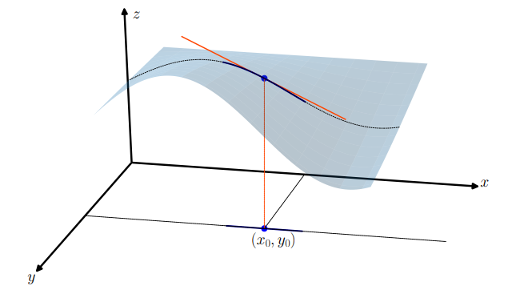
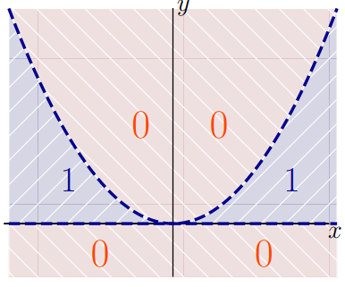
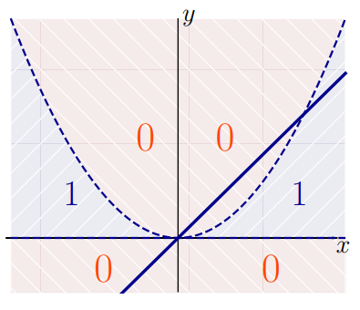

# CLASE 26 - 12/11/2025

## Derivadas parciales y direccionales

### Definición 7.1

Sea $f:\mathbb{R}^2\to\mathbb{R}$ y $(x_0,y_0)$ un punto de $\mathbb{R}^2$. Definimos la derivada parcial de $f$ respecto a la variable $x$ en el punto $(x_0,y_0)$ como el siguiente límite (si existe):

$$
\frac{\partial f}{\partial x}(x_0,y_0)=\lim_{h\to0}\frac{f(x_0+h,y_0)-f(x_0,y_0)}{h}
$$

Observar que el límite de la definición es un límite de una variable ($h$ es un real que tiende a $0$), que es exactamente el límite del cociente incremental de la función de una variable $f(x,y_0)$ que resulta de fijar la variable $y$ y al valor $y_0$.

De forma análoga se define la derivada direccional con respecto de $y$.

### Ejemplo 7.2

Veamos que ambas las derivadas parciales de $f(x,y)=x^2+y^2$ en el origen son nulas.

$$
\frac{\partial f}{\partial x}(0,0)=\lim_{h\to0}\frac{f(0+h,0)-f(0,0)}{h}=\lim_{h\to0}\frac{h^2-0}{h}=0
$$

$$
\frac{\partial f}{\partial y}(0,0)=\lim_{h\to0}\frac{f(0,0+h)-f(0,0)}{h}=\lim_{h\to0}\frac{h^2-0}{h}=0
$$

Para la motivación de la definición, estudiamos la función restringida a uno de los ejes. Si denominamos explícitamente a esta función como $g$, es decir, fijamos la segunda coordenada al valor $y=y_0$, y consideramos la función de una variable $g(x)=f(x,y_0)$. Entonces la definición de la derivada de $g$ en $x_0$ coincide con la definición de la derivada parcial de $f$ con respecto al punto $(x_0,y_0)$.

$$
g'(x_0)=\lim_{h\to0}\frac{g(x_0+h)-g(x_0)}{h}=\lim_{h\to0}\frac{f(x_0+h,y_0)-f(x_0,y_0)}{h}=\frac{\partial f}{\partial x}(x_0,y_0)
$$

Esta observación nos permite hacer cálculos de manera sencilla: si queremos hallar la derivada parcial respecto de $x$, basta considerar la variable $y$ como constante, y operar como sabemos hacerlo.

### Ejemplo 7.3

Si queremos hallar $\frac{\partial f}{\partial x}(1,1)$ para la función $f(x,y)=x^2y+5y$, debemos pensar en la función $x^2\cdot1+5$, derivar respecto de $x$ y evaluar en $1$.Resulta entonces que $\frac{\partial f}{\partial x}(1,1)=2$.

La definición se generaliza trivialmente para las funciones definidas en $\mathbb{R}^n$.
Se utilizan varias notaciones para las derivadas parciales de una función, pero las que usaremos en el curso son $\frac{\partial f}{\partial x}$ y $f_x$.

### Ejemplos 7.4

#### Ejemplo 1

Si $f(x,y)=x^2y+ye^{2x}$, entonces tenemos que:

- $\frac{\partial f}{\partial x}(x,y)=2xy+y2e^{2x}$
- $\frac{\partial f}{\partial y}(x,y)=x^2+e^{2x}$

#### Ejemplo 2

Si $f(x,y)=(y-x)^2+x^2y^2=x^2-2xy+y^2+x^2y^2$. Entonces:

- $\frac{\partial f}{\partial x}(x,y)=2x-2y+2xy^2$
- $\frac{\partial f}{\partial y}(x,y)=-2x+2y+x^22y$

Lo que ilustran estos dos ejemplos, es que a nivel cálculo de derivadas, no tenemos mayores diferencias de lo que conocemos. Cabe preguntarnos entonces si la derivabilidad, implica la continuidad.

### Ejemplo 7.5

Consideremos la función definida como $f(x,y)=\begin{cases}1 &\text{si } x=0\text{ o }y=0\\ 0 &\text{en otro caso}\end{cases}$

Entonces, como la función es constante en los ejes, entonces las derivadas parciales respecto a $x$ e $y$ existen, y valen $0$.
Sin embargo, la función no es continua en $(0,0)$, ya que no existe $\lim_{(x,y)\to(0,0)}f(x,y)$

Este análisis, nos lleva inevitablemente a tomar en cuenta el comportamiento de la función en otras direcciones (cuando hasta ahora solo consideramos las direcciones de los ejes).

### Definición 7.6 (derivada direccional)

Sea $f:\mathbb{R}^2\to\mathbb{R}$ una función, $(x_0,y_0)$ un punto de $\mathbb{R}^2$, y un vector dirección $v=(v_1,v_2)$. Entonces definimos la derivada direccional de $f$ respecto a la dirección $v$ en el punto $(x_0,y_0)$ como el siguiente límite si existe:

$$
\frac{\partial f}{\partial v}(x_0,y_0)=\lim_{h\to0}\frac{f(x_0+hv_1, y_0+hv_2)-f(x_0,y_0)}{h}
$$

Es decir, es exactamente el cociente incremental de la función que resulta de restringir $f$ a la recta de dirección $v$ por el punto $(x_0,y_0)$.

Observemos que las derivadas parciales son un caso particular de derivadas direccionales, específicamente cuando $v=(1,0)$ cuando buscamos la derivada parcial respecto a $x$ o $v=(0,1)$ cuando buscamos la derivada respecto a $y$.

### Ejemplo 7.7

Calculemos la **función** derivada direccional respecto a la dirección $v=(1,1)$ de la función $f(x,y)=x^2+y^2$:

$$
\begin{aligned}
&\frac{\partial f}{\partial (1,1)}(x_0,y_0)\\
&=\scriptstyle{(\text{definición})}\\
&\lim_{h\to0}\frac{(x_0+h)^2+(y_0+h)^2-x_0^2-y_0^2}{h}\\
&=\scriptstyle{(\text{operando})}\\
&\lim_{h\to0}\frac{x_0^2+2hx_0+h^2+y_0^2+2hy_0+h^2-x_0^2-y_0^2}{h}\\
&=\scriptstyle{(\text{operando})}\\
&\lim_{h\to0}\frac{2hx_0+h^2+2hy_0+h^2}{h}\\
&=\scriptstyle{(\text{operando})}\\
&\lim_{h\to0}\frac{h(2x_0+h+2y_0+h)}{h}\\
&=\scriptstyle{(\text{operando})}\\
&\lim_{h\to0}2x_0+h+2y_0+h\\
&=\scriptstyle{(\text{operando})}\\
&2x_0+2y_0\\
\end{aligned}
$$

Podríamos volver ahora al ejemplo 7.5, en el que es muy fácil ver que si tomamos una dirección distinta a las canónicas, la derivada direccional no existe.
Esto nos lleva a preguntarnos, si existen todas las derivadas direccionales para un punto, será que la función es continua para dicho punto?

### Ejemplo 7.9

Consideremos la función definida por:

$$
f(x,y)=\begin{cases}
1 &\text{si }0<y<x^2\\
0 &\text{en cualquier otro caso}
\end{cases}
$$

Y estudiaremos por un lado si existen todas las derivadas direccionales en $(0,0)$ y verificaremos si la función es continua en ese punto.

Primero estudiaremos las derivadas direccionales, para esto vamos a tomar una dirección $v=(v_1,v_2)$. Ahora queremos estudiar el límite del cociente incremental para $(0,0)$:

$$
\lim_{h\to0}\frac{f(hv_1,hv_2)-f(0,0)}{h}
$$

La primera observación que tenemos que hacer es que las derivadas parciales existen y son ambas $0$, pues la función es constante $0$ cuando alguna de las dos coordenadas se anula.
Por otro lado, algo fundamental de ver es que sin ser los ejes, cualquier otra recta (es decir, esto vale para cualquier dirección $v$) corta dos veces a la parábola $x^2$. Por lo tanto en alguna región cercana a $(0,0)$, la función vale $0$. Esto se puede ilustrar mejor con la siguiente imágen.

Por lo tanto, como la función vale $0$ para puntos arbitrariamente cerca de $(0,0)$, tenemos lo siguiente:

$$
\lim_{h\to0}\frac{f(hv_1,hv_2)-f(0,0)}{h}=0
$$

Por lo tanto existen todas las derivadas direccionales de $f$ para el punto $(0,0)$.
Entonces... La función es continua en dicho punto?
Bueno, es fácil determinar que la función no es continua para $(0,0)$, ya que arbitrariamente cerca de él existen puntos donde la función vale $1$ y también puntos donde la función vale $0$.

Entonces, la continuidad y la existencia de derivadas direccionales son conceptos independientes. Por lo tanto, estamos ante una idea de derivabilidad que no generaliza bien todas las ideas que traíamos de cálculo de una variable.