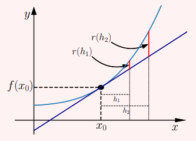
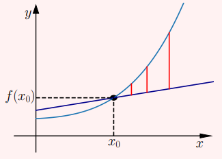
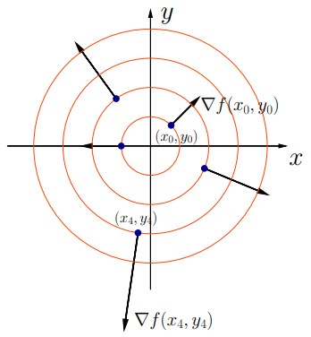

# CLASE 27 - 18/11/2025

## Diferenciabilidad

Para definir derivadas parciales, nos restringimos a rectas y consideramos el límite del cociente incremental, tal cual como lo hacíamos para funciones definidas en $\mathbb{R}$. Ahora haremos lo mismo para generalizar las nociones de otras variables, pero considerando otras propiedades que teníamos.
Específicamente, sea $f:\mathbb{R}\to\mathbb{R}$ una función derivable, y $x_0$ un punto de $\mathbb{R}$ Entonces, tenemos que:

$$
f(x_0+h)=f(x_0)+f'(x_0)h+r(h)
$$

Con $r:\mathbb{R}\to\mathbb{R}$, una función tal que $\lim_{h\to0}\frac{r(h)}{h}=0$, o sea que tiende a $0$ más rápido que $h$.
Esto significa que localmente, la función se aproxima bien por un polinomio de primer grado.
Geométricamente, en este caso corresponde a la aproximación por la recta tangente.

### Observación sobre el resto

Aprovechando que ya estamos familiarizados con las funciones de una variable para remarcar la importancia del resto. 
La función $r(h)$ mide que tan lejos se encuentra la aproximación lineal de la función, como se ilustra en la siguiente imágen, con la recta tangente.

Ahora, siempre que la aproximación lineal pase por el punto $(x_0,f(x_0))$, el error $r(h)$ tiende a cero cuando $h$ tiende a cero. Podemos ver un ejemplo en la siguiente imágen.

La moraleja es que, pedir que $r(h)\to0$ cuando $h\to0$, es casi pedir nada. Para que la aproximación sea buena, el error tiene que tender a cero **rápido**, en este caso más rápido que $h$.

### Definición 7.11

Sean $f:\mathbb{R}^n\to\mathbb{R}$, y $a\in\mathbb{R}^n$. Decimos que la función $f$ es diferenciable en $a$ sii existe una transformación lineal $df_a:\mathbb{R}^n\to\mathbb{R}$ tal que:

$$
f(a+h)=f(a)+df_a(h)+r(h)
$$

Con $r:\mathbb{R}^n\to\mathbb{R}$ una función que cumple $\lim_{h\to0}\frac{r(h)}{\|h\|}=0$

Aprovechemos la intución geométrica que estamos obteniendo para las funciones definidas en $\mathbb{R}^2$, y veamos como se traduce esta definición para este caso particular. Para eso, recordemos que las transformaciones lineales de $\mathbb{R}^2$ a $\mathbb{R}$ tienen la forma $T(x,y)=Ax+By$. Entonces podemos escribir la definición de diferenciabilidad así:

### Definición 7.12

Sean $f:\mathbb{R}^2\to\mathbb{R}$, y $a=(x_0,y_0)\in\mathbb{R}^2$. Decimos que la función $f$ es diferenciable en $(x_0,y_0)$ sii existen dos reales $A$ y $B$ tales que:

$$
f(x_0+\Delta x, y_0+\Delta y)=f(x_0,y_0)+A\Delta x+B\Delta y+r(\Delta x, \Delta y)
$$

con $r:\mathbb{R}^2\to\mathbb{R}$ un función que cumple $\lim_{(\Delta x, \Delta y)\to(0,0)}\frac{r(\Delta x,\Delta y)}{\|(\Delta x,\Delta y)\|}=0$

Aquí el incremento que antes llamabamos $h$, ahora es $(\Delta x, \Delta y)$, y la transformación lineal aplicada al incremento es $A\Delta x+B\Delta y$.
Como vimos en el caso de una variable, la propiedad del resto acá también es fundamental, ya que hay infinitos valores de $A$ y $B$ que hacen que el resto tienda a cero con $h$, pero la clave de una buena aproximación líneal es que el resto tienda a cero más rápido que la norma de $h$.

Ahora, veamos como se relaciona la definición de diferenciabiliad con la continuidad y la derivabilidad.

### Teorema 7.13

Sea $f:\mathbb{R}^2\to\mathbb{R}$ una función diferenciable en un punto $(x_0,y_0)$, entonces:

1. $f$ es continua en $(x_0,y_0)$
2. Existen las derivadas parciales en $(x_0,y_0)$ y valen $\frac{\partial f}{\partial x}(x_0,y_0)=A$ y $\frac{\partial f}{\partial y}(x_0,y_0)=B$
3. Existen todas las derivadas direccionales, y si $v=(v_1,v_2)$, entonces $\frac{\partial f}{\partial v}(x_0,y_0)=\frac{\partial f}{\partial x}(x_0,y_0)v_1+\frac{\partial f}{\partial y}(x_0,y_0)v_2$

#### Demostración

Estudiaremos cada implicancia por separado.

##### Implicancia #1

- $f$ es continua en $(x_0,y_0)$

Usando la definición de diferenciabilidad en $(x_0,y_0)$, tenemos que:

$$
\begin{aligned}
&\lim_{(\Delta x,\Delta y)\to(0,0)}f(x_0+\Delta x,y_0+\Delta y)\\
&=\scriptstyle{(\text{definición de diferenciabilidad})}\\
&\lim_{(\Delta x,\Delta y)\to(0,0)}f(x_0,y_0)+A\Delta x+B\Delta y+r(\Delta x,\Delta y)\\
&=\scriptstyle{(\text{sacando términos constantes})}\\
&f(x_0,y_0)+\lim_{(\Delta x,\Delta y)\to(0,0)}A\Delta x+B\Delta y+r(\Delta x,\Delta y)\\
&=\scriptstyle{(A\Delta x\to 0; B\Delta y\to0)}\\
&f(x_0,y_0)+\lim_{(\Delta x,\Delta y)\to(0,0)}r(\Delta x,\Delta y)\\
\end{aligned}
$$

Con esto ya podemos concluir, pues sabemos que cuando $(\Delta x,\Delta y)\to(0,0)$, entonces $r(\Delta x,\Delta y)\to0$, de hecho, sabemos que tiende a cero rápido, pero no lo necesitamos para demostrar esta parte.
Entonces, demostramos que la función $f$ en cualquier punto arbitrariamente cerca de $(x_0,y_0)$, efectivamente equivale a $f(x_0,y_0)$. Esto es en esencia la definición de continuidad.

##### Implicancia #2

- Existen las derivadas parciales en $(x_0,y_0)$ y valen $\frac{\partial f}{\partial x}(x_0,y_0)=A$ y $\frac{\partial f}{\partial y}(x_0,y_0)=B$

Para esta parte, planteamos la definición de derivada parcial y operamos desde ahí. Consideramos solo el caso de $\frac{\partial f}{\partial x}(x_0,y_0)$ ya que la derivada parcial respecto de $y$ es análoga.

$$
\begin{aligned}
&\frac{\partial f}{\partial x}(x_0,y_0)\\
&=\scriptstyle{(\text{definición de derivada parcial})}\\
&\lim_{h\to0}\frac{f(x_0+h,y_0)-f(x_0,y_0)}{h}\\
&=\scriptstyle{(\text{definición de diferenciabilidad})}\\
&\lim_{h\to0}\frac{f(x_0,y_0)+A\cdot h+B\cdot 0+r(h,0)-f(x_0,y_0)}{h}\\
&=\scriptstyle{(\text{operatoria})}\\
&A+\lim_{h\to0}\frac{r(h,0)}{h}\\
\end{aligned}
$$

Acá podemos usar la propiedad del resto, ya que $h$ es la norma del punto $(h,0)$. Por lo tanto se cumple que:

- $\frac{\partial f}{\partial x}(x_0,y_0)=A$

El razonamiento es análogo para $\frac{\partial f}{\partial y}(x_0,y_0)=B$.

##### Implicancia #3

- Existen todas las derivadas direccionales, y si $v=(v_1,v_2)$, entonces $\frac{\partial f}{\partial v}(x_0,y_0)=\frac{\partial f}{\partial x}(x_0,y_0)v_1+\frac{\partial f}{\partial y}(x_0,y_0)v_2$

Procedemos de forma similar a la implicancia #2, pero ahora considerando que:

- $A=\frac{\partial f}{\partial x}(x_0,y_0)=f_x(x_0,y_0)$ (notación)
- $B=\frac{\partial f}{\partial y}(x_0,y_0)=f_y(x_0,y_0)$ (notación)
- Sea $v=(v_1,v_2)$

Entonces, operando tenemos que:

$$
\begin{aligned}
&\frac{\partial f}{\partial v}(x_0,y_0)\\
&=\scriptstyle{(\text{definición de derivada direccional})}\\
&\lim_{h\to0}\frac{f(x_0+hv_1, y_0+hv_2)-f(x_0,y_0)}{h}\\
&=\scriptstyle{(\text{definición de diferenciabilidad})}\\
&\lim_{h\to0}\frac{\cancel{f(x_0,y_0)}+Ahv_1+Bhv_2+r(hv_1,hv_2)-\cancel{f(x_0,y_0)}}{h}\\
&=\scriptstyle{(\text{por implicancia \#2})}\\
&\lim_{h\to0}\frac{Ahv_1+Bhv_2+r(hv_1,hv_2)}{h}\\
&=\scriptstyle{(\text{operatoria})}\\
&Av_1+Bv_2+\lim_{h\to0}\frac{r(hv_1,hv_2)}{h}\\
&=\scriptstyle{(\text{operatoria})}\\
&Av_1+Bv_2+\lim_{h\to0}\frac{r(hv_1,hv_2)}{h}\cdot\frac{\|(v_1,v_2)\|}{\|(v_1,v_2)\|}\\
&=\scriptstyle{(\text{operatoria})}\\
&Av_1+Bv_2+\lim_{h\to0}\frac{r(hv_1,hv_2)}{h\|(v_1,v_2)\|}\cdot\|(v_1,v_2)\|\\
&=\scriptstyle{(\text{operatoria})}\\
&Av_1+Bv_2+\lim_{h\to0}\frac{r(hv_1,hv_2)}{\|(hv_1,hv_2)\|}\cdot\|(v_1,v_2)\|\\
\end{aligned}
$$

Donde nuevamente, usamos la propiedad del resto, por lo que el límite de la última igualdad es 0. Con esto, concluimos que:

- $\frac{\partial f}{\partial v}(x_0,y_0)=Av_1+B_v2$

Y por la implicancia #2:

- $\frac{\partial f}{\partial v}(x_0,y_0)=f_x(x_0,y_0)v_1+f_y(x_0,y_0)v_2$

Que es lo que queríamos probar. Esto concluye la demostración.

### Definición 7.14 (vector gradiente)

Dada $f:\mathbb{R}^2\to\mathbb{R}$ diferenciable en $(x_0,y_0)$, definimos el vector gradiente de $f$ en $(x_0,y_0)$ como $\nabla f(x_0,y_0)=\left(\frac{\partial f}{\partial x}(x_0,y_0),\frac{\partial f}{\partial y}(x_0,y_0)\right)$

**Observación:** Con esta notación, podemos expresar la derivada direccional como el producto interno del gradiente con la dirección:

- $\frac{\partial f}{\partial v}(x_0,y_0)=\left<\nabla f(x_0,y_0), v\right>$

Consideremos ahora un vector $v$ de norma $1$, y las derivadas direccionales de $f$ respecto a $v$.
Como tenemos que $\frac{\partial f}{\partial v}(x_0,y_0)=\left<\nabla f(x_0,y_0), v\right>$, entonces la derivada direccional se maximiza cuando el vector gradiente y $v$ son colineales.

Esto significa que la dirección del gradiente es la dirección de máximo crecimiento de $f$. En la siguiente figura podemos observar algunas curvas de nivel de una función y los vectores gradientes en algunos puntos.

**Observaciones:**

- Diremos que una función es diferenciable sii es diferenciable en todos los puntos del dominio.
- El dominio de la función no tiene porque ser todo $\mathbb{R}^n$, lo que necesitamos es que el punto $a$, para el que definimos la diferenciabilidad sea interior al dominio.

### Ejemplos 7.15

#### Ejemplo 1

Consideremos la función $f(x,y)=2x+3y+4$ y estudiemos la diferenciabilidad en el origen. Tenemos que las derivadas direccionales son:

- $f_x(x,y)=2$
- $f_y(x,y)=3$

Por lo que vimos en el teorema 7.13, lo que queremos probar es:

$$
f(0+\Delta x,0+\Delta y)=f(0,0)+2\Delta x+3\Delta y+r(\Delta x, \Delta y)
$$

Aquí, como $f(0,0)$ es $4$, despejando podemos observar que $r(\Delta x, \Delta y)$ es la función constante nula. Por lo tanto cumple con la propiedad que tiene que cumplir el resto.
Entonces esta función es diferenciable. Pero claro, tiene mucho sentido, pues esta función es lineal, entonces su aproximación lineal es ella misma.