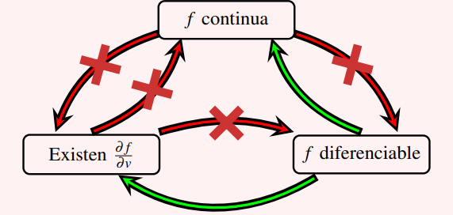

# CLASE 28 - 20/11/2025

## Diferenciablidad

### Ejemplos 7.15

#### Ejemplo 2

Consideremos ahora la función $f(x,y)=\begin{cases}\frac{xy}{\sqrt{x^2+y^2}} &\text{si }(x,y)\neq(0,0)\\0 &\text{si }(x,y)=(0,0)\end{cases}$

Para estudiar la diferenciabilidad en $(0,0)$, primero estudiemos las derivadas parciales:

$$
f_x(0,0)=\lim_{h\to0}\frac{f(h,0)-f(0,0)}{h}=\lim_{h\to0}\frac{0}{h}=0
$$

El caso para $f_y$ es análogo pues la función es constante nula para los ejes.
Con esto podemos plantear la definición de diferenciabilidad:

$$
f(0+\Delta x, 0+\Delta y)=f(0,0)+0\cdot\Delta x+0\cdot\Delta y+r(\Delta x, \Delta y)
$$

Por lo tanto, la expresión nos dice que de alguna forma, el resto es toda la función, pues la mejor aproximación es el plano del "piso". Veamos entonces, si el supuesto resto (entonces la función) cumple con la propiedad del resto.

$$
\begin{aligned}
&\lim_{(\Delta x,\Delta y)\to(0,0)}\frac{r(\Delta x,\Delta y)}{\|(\Delta x,\Delta y)\|}\\
&=\scriptstyle{(\text{reemplazando por la función y def. de norma})}\\
&\lim_{(\Delta x,\Delta y)\to(0,0)}\frac{1}{\sqrt{\Delta x^2+\Delta y^2}}\cdot\frac{\Delta x\Delta y}{\sqrt{\Delta x^2+\Delta y^2}}\\
&=\scriptstyle{(\text{operando})}\\
&\lim_{(\Delta x,\Delta y)\to(0,0)}\frac{\Delta x\Delta y}{\Delta x^2+\Delta y^2}\\
\end{aligned}
$$

Donde observamos que este límite no existe. Podríamos expandir sobre esto tomando las direcciones $\Delta y=0$ y luego $\Delta y=\Delta x$. La primera nos da límite $0$, y la segunda nos da límite $\frac{1}{2}$.

Con esto concluimos que la función no es diferenciable.

### Implicacias de la diferenciabilidad

Veamos un diagrama que representa las relaciones entre continuidad, existencia de derivadas direccionales y diferenciabilidad:

### Plano tangente

Volviendo a la idea geométrica que nos sirvió de intuición para definir diferenciablidad, veamos explícitamente cual es la ecuación del plano tangente en un punto al gráfico de una función diferenciable.

Sea entonces una función $f$ diferenciable en el punto $(x_0,y_0)$. Entonces la ecuación del plano tangente por $(x_0,y_0)$ es:

$$
z=f(x_0,y_0)+f_x(x_0,y_0)(x-x_0)+f_y(x_0,y_0)(y-y_0)
$$

Por ejemplo, si la función $f=x^2+y^2$, y consideramos el punto $(1,2)$, entonces la ecuación del plano tangente para este punto es:

$$
z=5+2(x-1)+4(y-2)
$$

### Teorema 7.17 (condición suficiente de diferenciabilidad)

Sea $f:\mathbb{R}^2\to\mathbb{R}$ una función y $(x_0,y_0)\in\mathbb{R}^2$ un punto, tales que las derivadas parciales de $f$ existen en una bola de centro $(x_0,y_0)$ y ambas son continuas en $(x_0,y_0)$. Entonces $f$ es diferenciable en $(x_0,y_0)$.

#### Demostración

No se hace en el teórico, pero está en las notas.
Lo más importante de este teorema es saber aplicarlo y como nos facilita demostrar la diferenciabilidad de una función $f$ en un punto $(x_0,y_0)$.

#### Ejemplo

Revisitemos la primera función de esta clase (Ejemplo 7.15 #2), es decir la función $f(x,y)=\begin{cases}\frac{xy}{\sqrt{x^2+y^2}} &\text{si }(x,y)\neq(0,0)\\0 &\text{si }(x,y)=(0,0)\end{cases}$
Anteriormente probamos que no es diferenciable en $(0,0)$, sabemos que existen las derivadas parciales para dicho punto (porque las calculamos), por lo que entonces lo que tiene que fallar es la continuidad de las derivadas parciales.
Sabemos que:

- $f_x(0,0)=0$
- $f_y(0,0)=0$

Ahora, calculemos la derivada respecto de $x$ para un punto genérico $(x_0,y_0)\neq(0,0)$:

$$
\begin{aligned}
&f_x(x_0,y_0)\\
&=\scriptstyle{(\text{derivada del cociente: }f=xy;f'=y;g=\sqrt{x^2+y^2};g'=\frac{2x}{2\sqrt{x^2+y^2}})}\\
&\left(y\sqrt{x^2+y^2}-\frac{xy\cancel{2}x}{\cancel{2}\sqrt{x^2+y^2}}\right)\cdot\frac{1}{x^2+y^2}\\
&=\scriptstyle{(\text{operatoria})}\\
&\left(y\sqrt{x^2+y^2}-\frac{yx^2}{\sqrt{x^2+y^2}}\right)\cdot\frac{1}{x^2+y^2}\\
&=\scriptstyle{(\text{operatoria})}\\
&\left(\frac{y(x^2+y^2)-yx^2}{\sqrt{x^2+y^2}}\right)\cdot\frac{1}{x^2+y^2}\\
&=\scriptstyle{(\text{operatoria})}\\
&\frac{y}{\sqrt{x^2+y^2}}\left(x^2+y^2-x^2\right)\cdot\frac{1}{x^2+y^2}\\
&=\scriptstyle{(\text{operatoria})}\\
&\frac{y^3}{(x^2+y^2)^{3/2}}
\end{aligned}
$$

Recordemos que, la derivada parcial respecto de $x$ en el punto $(0,0)$ vale 0, pero observemos que:

$$
\begin{aligned}
&\lim_{(x,y)\to(0,0)}\frac{y^3}{(x^2+y^2)^{3/2}}\\
&=\scriptstyle{(\text{límite direccional para }x=0)}\\
&\lim_{y\to0}\frac{y^3}{y^3}\\
&=\scriptstyle{(\text{operatoria})}\\
&1
\end{aligned}
$$

Listo, esto nos permite concluir que la función $f_x$ no es continua en el punto $(0,0)$ (pues el valor funcional no corresponde con el límite).
Entonces esto se corresponde con lo que hallamos en el ejercicio, la función no es diferenciable.

### Proposición

Sean $f:\mathbb{R}^2\to\mathbb{R}$ y $g:\mathbb{R}^2\to\mathbb{R}$ dos funciones diferenciables. Entonces:

1. $\lambda f$ es diferenciable
2. $f+g$ es diferenciable
3. $fg$ es diferenciable
4. Si $g$ no se anula en un entorno de $(x_0,y_0)$, entonces $f/g$ es diferenciable en ese punto.