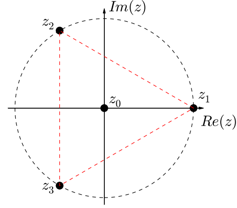
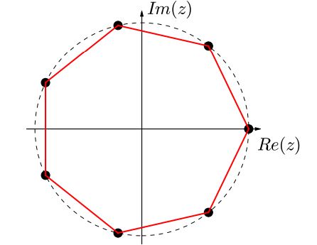

# CLASE 3 - 25/7/2025

## Números complejos

### Ejemplo

Busquemos todos los números $z\in\mathbb{C}$ que cumplan que $z^2=\overline{z}$.

Si escribimos $z$ en su notación polar, tenemos que:

- $z=\varrho e^{i\theta}$, esto nos deja con la ecuación:
- $(\varrho e^{i\theta})^2=\varrho e^{i-\theta}$

Luego de desarrollar, la ecuación que queremos resolver es:

- $\varrho^2 e^{i2\theta}=\varrho e^{i-\theta}$

Igualamos módulo y ángulo:

$$
\begin{cases}
\varrho^2=\varrho\\
2\theta=-\theta+2k\pi\quad\text{con }k\in\mathbb{Z}
\end{cases}
$$

**Observación**: Es muy importante trabajar con los múltiplos de $2k\pi$ cuando estamos viendo ángulos.

Entonces, de la primera obtenemos que:

- $\varrho=0$, o
- $\varrho=1$

Y de la segunda tenemos que:

- $\theta=\frac{2k\pi}{3}\quad\text{con }k\in\mathbb{Z}$

Llegados a este punto, pareciera que tenemos infinitas soluciones (una para cada entero $k$), pero rápidamente vamos a notar que los ángulos se comienzan a repetir:

- $k=0\to\theta_0=0$
- $k=1\to\theta_1=\frac{2\pi}{3}$
- $k=2\to\theta_2=\frac{4\pi}{3}$
- $k=3\to\theta_3=\frac{6\pi}{3}=2\pi=0$

Por lo que ya a partir de $k=3$, tenemos que las soluciones empiezan a repetirse. Esto nos deja con 4 soluciones (1 para $\varrho=0$ y las otras 3 para $\varrho=1$):

1. $z_0=0$
2. $z_1=1$
3. $z_2=e^{i\frac{2\pi}{3}}$
4. $z_3=e^{i\frac{4\pi}{3}}$

#### Observación

Si la ecuación hubiera sido $z^{11}=\overline{z}$, la podríamos haber resuelto muy fácilmente de la misma forma, ya que la notación polar nos permite trabajar muy fácilmente con el producto de un complejo.
No así con la notación binómica.

### Raíces complejas

Vamos a estudiar lo que se denominan las raíces enésimas de la unidad, es decir: dado un natural $n$, buscamos números complejos $z$ tales que $z^n=1$.

Procediendo de forma similar al ejemplo anterior, escribimos $z=\varrho e^{i\theta}$, entonces la ecuación queda como:

- $\varrho^ne^{in\theta}=1e^{i0}$

Igualamos módulo y ángulo:

$$
\begin{cases}
\varrho^n=1\\
n\theta=2k\pi\quad\text{con }k\in\mathbb{Z}
\end{cases}
$$

A partir de esto obtenemos que:

- $\varrho=1$ (pues $\varrho>0$)
- $\theta=\frac{2k\pi}{n}\quad\text{con }k\in\mathbb{Z}$

Veamos los ángulos que nos deja la segunda igualdad:

- $\theta_0=0$
- $\theta_1=\frac{2\pi}{n}$
- $\theta_2=\frac{4\pi}{n}$
- $\theta_3=\frac{6\pi}{n}$
- $\ldots$
- $\theta_{n-1}=\frac{2(n-1)\pi}{n}$
- $\theta_n=\frac{2n\pi}{n}=2\pi=0$

Esto nos deja con $n$ soluciones, según cada uno de los ángulos desde $k=0$ hasta $k=n-1$ (pues se empiezan a repetir a partir de $k=n$).

**Observación:** Veamos que si un complejo $z$ es solución, también lo es $\overline{z}$.

#### Observación

Se puede extender la resolución de este ejercicio para cualquier número complejo, no solamente el 1. El método de resolución es el mismo que el utilizado hasta ahora, expresando el complejo dado con su notación polar e igualando módulo y ángulo.