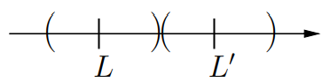

# CLASE 7 - 26/08/2025

## Sucesiones

### Definición 3.1

Una sucesión es una función de naturales en los reales $a:\mathbb{N}\to\mathbb{R}$.
Al elemento enésimo de la sucesión, es decir $a(n)$, se lo denota $a_n$, y a toda la sucesión $(a_n)_{n\in\mathbb{N}}$.
Muchas veces hacemos un abuso de notación y nos referimos a la sucesión entera simplemente como $a_n$, en estos casos nos vamos a basar en el contexto para entender a que nos estamos refiriendo.

### Ejemplos 3.2

1. $a_n=\frac{1}{n}$
    - Sus elementos son $\{1,\frac{1}{2},\frac{1}{3},\ldots\}$
2. $a_n=1\quad\forall n$
    - Sus elementos son $\{1\}$
3. $a_n=(-1)^n$
    - Sus elementos son $\{-1,1\}$
4. $a_n=n$
    - Sus elementos son $\{1,2,3,\ldots
    \}$

Es importante notar que al listar sus elementos como un conjunto, perdemos por ejemplo el órden de los mismos en la sucesión.
En general el comportamiento que más nos va a importar de una sucesión es lo que pasa con ella "en el infinito", para eso, veamos la definición de límite.

### Definición 3.3

Decimos que la sucesión $a_n$ tiene límite $L\in\mathbb{R}$, y lo denotamos $\lim_{n\to\infty}a_n=L$ sii:

- $\forall\varepsilon>0,\exists n_0\in\mathbb{N}$ tal que $\forall n\geq n_0: a_n\in E(L,\varepsilon)$

Recordemos que el entorno $E(L,\varepsilon)$ es el conjunto de puntos $x\in\mathbb{R}$ tales que $|x-L|<\varepsilon$.

Es decir, que para cualquier valor de $\varepsilon$ positivo, existe un valor natural $n_0$, tal que para cualquier $n$ mayor a dicho valor, el valor de la sucesión $a_n$ está en un entorno de centro $L$ y radio $\varepsilon$.

#### Ejemplo

En el ejemplo que vimos anteriormente, con la sucesión $a_n=\frac{1}{n}$, vemos que a medida que $n$ crece, $a_n$ va decreciendo. Probemos que su límite es $0$.
Tomamos $\varepsilon>0$ cualquiera, lo que queremos probar es que $a_n\in E(0,\varepsilon)$, que es lo mismo que:

- $|a_n-0|<\varepsilon$, es decir que:
- $\frac{1}{n}<\varepsilon$

Observemos (despejando) que esto último, se cumple sii:

- $n>\frac{1}{\varepsilon}$

Por lo tanto, tomando $n_0=[\frac{1}{\varepsilon}]+1$, tenemos resuelto el ejercicio.

### Proposición 3.4

Si existe el límite de $a_n$, entonces es único.

#### Demostración

Supongamos que existen dos límites distintos $L$ y $L'$. Por lo tanto tenemos que:

- $\forall\varepsilon>0:\exists n_1\in\mathbb{N}$ tal que $\forall n>n_1: a_n\in E(L,\varepsilon)$
- $\forall\varepsilon>0:\exists n_2\in\mathbb{N}$ tal que $\forall n>n_2: a_n\in E(L',\varepsilon)$

Tomemos $n_0=\max\{n_1,n_2\}$ y $\varepsilon=\frac{|L-L'|}{2}$ de modo que $E(L,\varepsilon)\cap E(L',\varepsilon)=\emptyset$.
Como los dos son límites, a partir de $n_0$ sabemos que $a_n$ tiene que pertenecer a ambos:

- $E(L,\varepsilon)$, y
- $E(L',\varepsilon)$

Pero esto es imposible pues son disjuntos. Con esto concluimos que $L= L'$ y por lo tanto el límite es único.