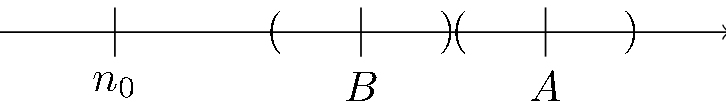

# CLASE 9 - 27/08/2025

## Sucesiones

### Ejercicio 3.10

1. Demostrar que si $a_n\leq b_n,\forall n\in\mathbb{N}$ y ambas tienen límite, entonces $\lim a_n\leq \lim b_n$
2. Si $a_n$ es acotada y $\lim b_n=0$, demostrar que $\lim a_nb_n=0$

#### Parte 1

Llamemos:

- $A=\lim a_n$, y
- $B=\lim b_n$

Probaremos esta propiedad por absurdo, entonces supongamos que $B<A$:

Como sabemos que ambas sucesiones tienen límite, tenemos que:

- $\forall\varepsilon>0,\exists n_1\in\mathbb{N}$ tal que $\forall n>n_1:a_n\in E(A,\varepsilon)$
- $\forall\varepsilon>0,\exists n_2\in\mathbb{N}$ tal que $\forall n>n_2:b_n\in E(B,\varepsilon)$

Esto nos permite considerar:

- $n_0=\max\{n_1,n_2\}$, y
- $\varepsilon= \frac{|A-B|}{2}$

De forma que $E(B,\varepsilon)\cap E(A,\varepsilon)=\emptyset$.
Gráficamente la situación se ve algo así:

Entonces ahora consideremos cualquier $n>n_0$, para este se tiene que cumplir que:

- $a_n\in E(A,\varepsilon)$
- $b_n\in E(B,\varepsilon)$

Pero como son disjuntos y el entorno $E(A,\varepsilon)$ está más adelante en la recta que $E(B,\varepsilon)$, necesariamente vamos a tener que:

- $b_n<a_n$ para todo $n>n_0$

Pero esto es absurdo pues estamos contradiciendo la hipótesis que nos dice que:

- $a_n\leq b_n,\forall n\in\mathbb{N}$

Por lo que queda probada la propiedad.

#### Parte 2

Como $\lim b_n=0$, tenemos que:

- $\forall\varepsilon>0,\exists n_0\in\mathbb{N}$ tal que $\forall n>n_0: |b_n-0| < \varepsilon$

Como $a_n$ es acotada, tenemos que:

- $\exists K\in\mathbb{R}$ tal que $\forall n\in\mathbb{N}:|a_n|< K$

Tomamos $\varepsilon_1=\frac{\varepsilon}{K}>0$ y como $\lim b_n=0$ tenemos que:

- $\exists n_0\in\mathbb{N}$ tal que $\forall n>n_0:|b_n|<\frac{\varepsilon}{K}$

Operando a partir de este punto, $\forall n>n_0$ tenemos que:

$$
\begin{aligned}
&|b_n|<\frac{\varepsilon}{K}\\
&\iff\scriptstyle{(\text{operando})}\\
&K|b_n|<\varepsilon\\
&\iff\scriptstyle{(a_n\text{ acotada})}\\
&|a_n||b_n|<K|b_n|<\varepsilon\\
&\iff\scriptstyle{(\text{operando})}\\
&|a_nb_n|<K|b_n|<\varepsilon\\
&\iff\scriptstyle{(\text{simplificando})}\\
&|a_nb_n|<\varepsilon\\
\end{aligned}
$$

Como demostramos esto para todo $n>n_0$, probamos que efectivamente:

- $\forall\varepsilon>0,\exists n_0\in\mathbb{N}$ tal que $\forall n>n_0: |a_nb_n|<\varepsilon$

Lo que es equivalente a decir que:

- $\lim a_nb_n=0$

### Teorema 3.11 (propiedades de límite)

Sean $a_n,b_n$ dos sucesiones tales que $\lim a_n=A$ y $\lim b_n=B$. Entonces:

1. $\lim a_n+b_n=A+B$
2. $\lim a_nb_n=AB$
3. Si $B\neq0$, entonces $\lim \frac{a_n}{b_n}=\frac{A}{B}$

En todos los casos, por hipótesis tenemos que:

- $\forall\varepsilon>0,\exists n_1$ tal que $\forall n>n_0: |a_n-A|<\varepsilon\quad(*_1)$
- $\forall\varepsilon>0,\exists n_2$ tal que $\forall n>n_0: |b_n-B|<\varepsilon\quad(*_2)$

#### Demostración 1

- $\lim a_n+b_n=A+B$

Por definición de límite, queremos probar que:

- $\forall\varepsilon>0,\exists n_0$ tal que $\forall n>n_0: |a_n+b_n-A-B|<\varepsilon$

Consideremos $\varepsilon=\frac{\varepsilon}{2}$ y $n_0=\max\{n_1,n_2\}$ y el siguiente razonamiento $\forall n>n_0$:

$$
\begin{aligned}
&|a_n+b_n-A-B|\\
&=\scriptstyle{(\text{reordenando})}\\
&|a_n-A+b_n-B|\\
&\leq\scriptstyle{(\text{desigualdad triangular})}\\
&|a_n-A|+|b_n-B|\\
&<\scriptstyle{(\text{def. de límite})}\\
&\frac{\varepsilon}{2}+\frac{\varepsilon}{2}\\
&=\\
&\varepsilon
\end{aligned}
$$

Por lo tanto, probamos lo que queríamos verificar, y eso implica que:

- $\lim a_n+b_n=A+B$

**Observación:** Esta propiedad es válida también cuando hay una resta, y su prueba es análoga.

#### Demostración 2

- $\lim a_nb_n=AB$

Por definición de límite, queremos probar que:

- $\forall\varepsilon>0,\exists n_0\in\mathbb{N}$ tal que $\forall n>n_0: |a_nb_n-AB|<\varepsilon$

Consideremos $\varepsilon=$ y $n_0=\max\{n_1,n_2\}$ y el siguiente razonamiento $\forall n>n_0$:

$$
\begin{aligned}
&|a_nb_n-AB|\\
&=\\
&|a_nb_n+Ab_n-Ab_n-AB|\\
&=\\
&|A(b_n-B)+b_n(a_n-A)|\\
&\leq\scriptstyle{(\text{desigualdad triangular})}\\
&|A||b_n-B|+|b_n||a_n-A|\\
\end{aligned}
$$

Observemos los sumados por separado por  $a_n$ y $b_n$:

- $|A||b_n-B|<\frac{\varepsilon}{2|A|}$, por definición de límite. $(*_1)$

**Atención:** Si $A=0$ entonces la propiedad cae en las hipótesis de la vista en la parte 3.10, por lo que consideramos $A\neq0$

Por otra parte tenemos que, como $\lim b_n=B$, tenemos que $b_n$ es acotada (propiedad vista anteriormente), por lo tanto:

- $\exists K\in\mathbb{R}$ tal que $\forall n\in\mathbb{N}: |b_n|<K$

Con esto, veamos que:

- $|b_n||a_n-A|< K|a_n-A|<\frac{\varepsilon}{2K}$, por definición de límite. $(*_2)$

**Atención:** En ambos puntos $(*_1)$ y $(*_2)$ estamos considerando $n>n_0$ para usar la definición de límite.

Ahora podemos redondear el ejercicio retomando el primer razonamiento que hicimos:

$$
\begin{aligned}
&|A||b_n-B|+|b_n||a_n-A|\\
&<\scriptstyle{(\text{por }(*_1),(*_2))}\\
&|A|\cdot\frac{\varepsilon}{2|A|}+|b_n|\frac{\varepsilon}{2K}\\
&=\scriptstyle{(\text{simplificando})}\\
&\frac{\varepsilon}{2}+\frac{\varepsilon}{2}\\
&=\\
&\varepsilon
\end{aligned}
$$

Por lo tanto, probamos lo que queríamos verificar, y eso implica que:

- $\lim a_nb_n=AB$

### Ejercicio 3.13

Decimos que un par de sucesiones $a_n$ y $b_n$ forman un par de sucesiones monótonas convergentes (PSMC) sii:

- $(*_1)$ $a_n$ es creciente y $b_n$ es decreciente.
- $(*_2)$ $a_n\leq b_n$ para todo $n\in\mathbb{N}$
- $(*_3)$ Dado $\varepsilon>0$, existe $n_0\in\mathbb{N}$ tal que $b_{n_0}-a_{n_0}<\varepsilon$

Queremos probar lo siguiente:

1. Demostrar que $a_n\leq b_m$ para todo $n,m\in\mathbb{N}$
2. Demostrar que ambas sucesiones tienen límite, que llamaremos $\lim a_n = L$ y $\lim b_n = L'$.
3. Deducir que $L\leq L'$
4. Demostrar que $L=L'$ (y observar que recién ahora es necesaria la propiedad $(*_3)$)

#### Resolución 3.13

##### Parte 1

- Demostrar que $a_n\leq b_m$ para todo $n,m\in\mathbb{N}$

Separemos en tres casos:

- $n=m$ trivial por $(*_1)$
- $n\leq m$
- $m\leq n$

**$n\leq m$**:

Observemos que por $(*_1)$ tenemos que:

- $a_n\leq b_n\quad\forall n\in\mathbb{N}$

Y ahora, considerando que $a_n$ es creciente, tenemos que:

$$
\begin{aligned}
&a_n\\
&\leq\scriptstyle{(a_n\text{ es creciente})}\\
&a_m\\
&\leq\scriptstyle{(\text{por }(*_1))}\\
&b_m
\end{aligned}
$$

Por lo tanto esta parte cumple.

**$m\leq n$**:

Observemos que por $(*_1)$ tenemos que:

- $a_n\leq b_n\quad\forall n\in\mathbb{N}$

Y ahora, observando que $b_n$ es decreciente, tenemos que:

$$
\begin{aligned}
&a_n\\
&\leq\scriptstyle{(\text{por }(*_1))}\\
&b_n\\
&\leq\scriptstyle{(b_n\text{decreciente})}\\
&b_m
\end{aligned}
$$

Y como esta parte también se cumple, queda probada la propiedad para cualesquiera $n,m\in\mathbb{N}$

##### Parte 2

- Demostrar que ambas sucesiones tienen límite, que llamaremos $\lim a_n = L$ y $\lim b_n = L'$.

Primero probemos que $a_n$ tiene límite, esto es sencillo pues:

- $a_n\leq b_m\quad\forall n,m\in\mathbb{N}$

Entonces considerando $b_1$, tenemos que:

- $a_n\leq b_1\quad\forall n\in\mathbb{N}$

Entonces $a_n$ está acotada superiormente por $b_1$.
Y como $a_n$ es monótona y está acotada: tiene límite.

Ahora veamos que podemos hacer el mismo razonamiento para $b_n$ considerando como cota inferior $a_1$.

Por lo tanto $b_n$ está acotada inferiormente por $a_1$.
Y como $b_n$ es monótona y está acotada: tiene límite.

##### Parte 3

- Deducir que $L\leq L'$

Directo por el ejercicio 3.10

##### Parte 4

- Demostrar que $L=L'$ (y observar que recién ahora es necesaria la propiedad $(*_3)$)

Teniendo que $L\leq L'$, supongamos que $L<L'$.
En particular, como tenemos:

- $a_n\leq L$ por ser creciente y,
- $L'\leq b_n$ por ser decreciente

Se cumple la siguiente desigualdad:

- $a_n\leq L<L'\leq b_n\quad\forall n\in\mathbb{N}$

De donde se obtiene la siguiente desigualdad:

- $b_n-a_n\geq L'-L\quad\forall n\in\mathbb{N}$

Recordemos la propiedad:

- $(*_3)$ Dado $\varepsilon>0$, existe $n_0\in\mathbb{N}$ tal que $b_{n_0}-a_{n_0}<\varepsilon$

Si consideramos $\varepsilon = L'-L$, esta propiedad no se cumple. Por lo tanto llegamos a un absurdo, con esto podemos concluir que:

- $L=L'$

### Definición 3.16

Decimos que dos sucesiones $a_n$ y $b_n$, ambas con límite $0$ o $\infty$, son equivalentes si $\lim_{n\to+\infty}\frac{a_n}{b_n}=1$

**Atención:** Hay que tener cuidado cuando sustituimos por sucesiones equivalentes, cuando resulta en la resta de dos equivalentes que se anulan.

#### Ejemplo 3.17

Las sucesiones $a_n=4n^3+2n+1$ y $b_n=4n^3$ son equivalentes. En efecto:

$$
\lim_{n\to\infty} \frac{4n^3+2n+1}{4n^3}=\lim_{n\to\infty} \frac{4n^3}{4n^3}+\frac{1}{2n^2}+\frac{1}{4n^3}=1
$$

Cuando tenemos un polinomio en $n$, es equivalente a su término de mayor grado. En general, tenemos las mismas equivalencias que teníamos para funciones.

#### Ejemplo

Las sucesiones $a_n=sen(\frac{1}{n})$ y $b=\frac{1}{n}$ son equivalentes.

Observemos que cuando $x$ tiende a 0 $sen(\frac{1}{n})\sim x$ (desarrollo de Taylor).

Entonces como $\frac{1}{n}$ tiende a 0 cuando $n$ tiende a $\infty$:

- $sen(\frac{1}{n})\sim\frac{1}{n}$

Cuando $n\to\infty$.